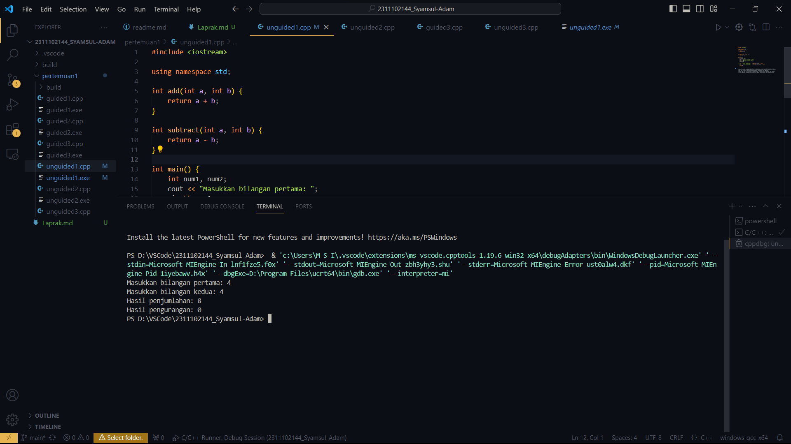
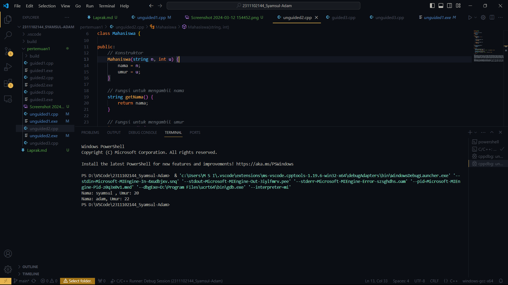
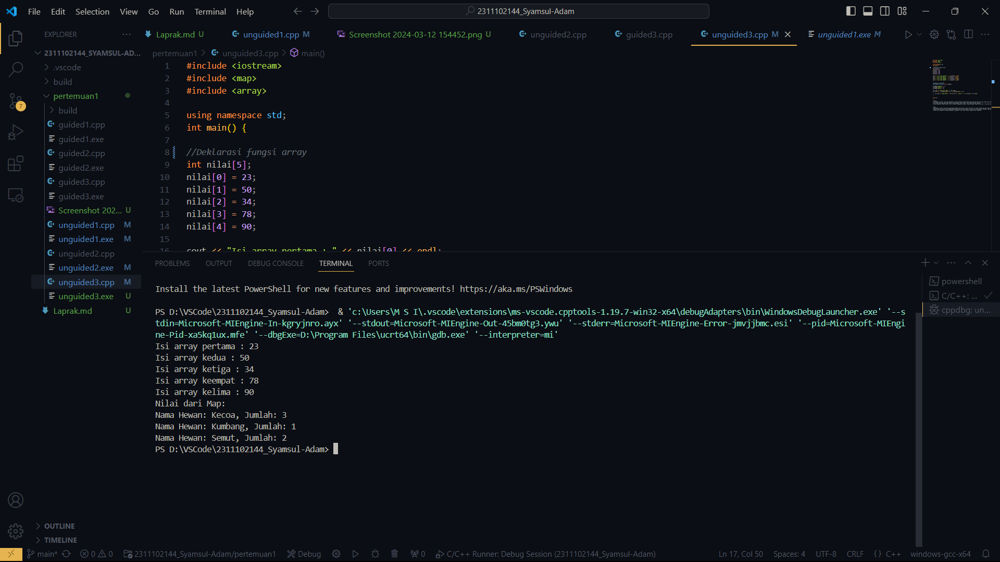

# <h1 align="center">Laporan Praktikum Modul-1 Tipe Data</h1>
<p align="center">Syamsul Adam 2311102144</p>

## Dasar Teori

Dasar teori tipe data dalam pemrograman adalah pengklasifikasian data berdasarkan jenis data tersebut. Tipe data dibutuhkan agar kompiler dapat mengetahui bagaimana sebuah data akan digunakan. Terdapat tiga jenis tipe data yang umum digunakan, yaitu:
1. Tipe data Primitif: Tipe data ini hanya dapat menyimpan satu nilai pada satu waktu dan tidak dapat diubah menggunakan cara yang sama seperti tipe data non-primitif. Contoh tipe data primitif adalah int, float, char, dan bool.

2. Tipe data Abstrak: Tipe data ini merupakan tipe data yang didefinisikan oleh programmer, yang tidak dapat langsung diakses oleh kompiler. Contoh tipe data abstrak adalah record, struct, dan enum

3. Tipe data Koleksi: Tipe data ini merupakan tipe data yang berupa rangkaian atau kumpulan data ataupun obyek yang berindeks. Contoh tipe data koleksi adalah array, list, dan set

## Guided 

### 1. [Tipe Data Primitif]

```C++
#include <iostream> // Mendeklarasikan library iostream
#include <iomanip>  // Mendeklarasikan library iomanip
using namespace std;   // Menggunakan namespace std

int main(){          // Fungsi utama
    char op;         // Membuat variabel op dengan tipe data char
    float num1, num2; // Membuat variabel num1 dan num2 dengan tipe data float

    cout<<"Enter operator (+, -, *, /): "; // Menampilkan teks "Enter operator (+, -, *, /): "
    cin>>op;          // Meminta input operator dan menyimpannya ke variabel op

    cout<<"Enter two operands: "; // Menampilkan teks "Enter two operands: "
    cin>>num1>>num2; // Meminta input dua operand dan menyimpannya ke variabel num1 dan num2

    switch (op){     // Memulai blok switch
        case '+':    // Jika operator adalah '+'
            cout<<"Result: "<<num1 + num2; // Menampilkan hasil penjumlahan dari num1 dan num2
            break;
        case '-':    // Jika operator adalah '-'
            cout<<"Result: "<<num1 - num2; // Menampilkan hasil pengurangan dari num1 dan num2
            break;
        case '*':    // Jika operator adalah '*'
            cout<<"Result: "<<num1 * num2; // Menampilkan hasil perkalian dari num1 dan num2
            break;
        case '/':    // Jika operator adalah '/'
            if (num2 != 0) { // Jika operand kedua tidak sama dengan 0
                cout<<"Result: "<< fixed << setprecision(2)<< num1 / num2; // Menampilkan hasil pembagian dari num1 dan num2 dengan dua angka di belakang koma
            } else { // Jika operand kedua sama dengan 0
                cout << "Error! Division by zero is not allowed."; // Menampilkan pesan kesalahan "Error! Division by zero is not allowed."
            }
            break;
        default:     // Jika operator tidak sesuai dengan operator yang valid
            cout<<"Error! Operator is not correct"; // Menampilkan pesan kesalahan "Error! Operator is not correct"
    }

    return 0; // Mengakhiri program
}
```
Kode di atas adalah sebuah program kalkulator sederhana yang mengimplementasikan operator aritmatika dasar (+, -, *, /). Program ini menggunakan konsep "switch-case" untuk mengevaluasi operator yang diinputkan dan melakukan operasi aritmatika yang sesuai.

### 2. [Tipe Data abstrak]
```C++
#include <stdio.h>
#include <string.h>

struct Mahasiswa
{
    char name[50];
    char address[100];
    int age;
};
int main() // Fungsi utama
{
    struct Mahasiswa mhs1, mhs2; // Membuat dua variabel mhs1 dan mhs2 dengan tipe data struct Mahasiswa

    strcpy(mhs1.name, "Dian"); // Menyalin string "Dian" ke variabel name pada struct mhs1
    strcpy(mhs1.address, "Mataram"); // Menyalin string "Mataram" ke variabel address pada struct mhs1
    mhs1.age = 22; // Menetapkan nilai 22 ke variabel age pada struct mhs1
    strcpy(mhs2.name, "Bambang"); // Menyalin string "Bambang" ke variabel name pada struct mhs2
    strcpy(mhs2.address, "Surabaya"); // Menyalin string "Surabaya" ke variabel address pada struct mhs2
    mhs2.age = 23; // Menetapkan nilai 23 ke variabel age pada struct mhs2

    printf("## Mahasiswa 1 ##\n"); // Menampilkan teks "## Mahasiswa 1 ##"
    printf("Nama: %s\n", mhs1.name); // Menampilkan nilai dari variabel name pada struct mhs1
    printf("Alamat: %s\n", mhs1.address); // Menampilkan nilai dari variabel address pada struct mhs1
    printf("Umur: %d\n", mhs1.age); // Menampilkan nilai dari variabel age pada struct mhs1
    printf("\n"); // Menampilkan baris baru
    printf("## Mahasiswa 2 ##\n"); // Menampilkan teks "## Mahasiswa 2 ##"
    printf("Nama: %s\n", mhs2.name); // Menampilkan nilai dari variabel name pada struct mhs2
    printf("Alamat: %s\n", mhs2.address); // Menampilkan nilai dari variabel address pada struct mhs2
    printf("Umur: %d\n", mhs2.age); // Menampilkan nilai dari variabel age pada struct mhs2
    return 0; // Mengakhiri program
}
```
Kode Program ini menyimpan informasi tentang dua mahasiswa, yaitu Dian dan Bambang, yang berasal dari Mataram dan Surabaya, dan berumur 22 dan 23 tahun. Informasi tentang mahasiswa tersebut disimpan dalam dua variabel mhs1 dan mhs2 dengan tipe data struct Mahasiswa. Program ini kemudian menampilkan informasi tentang mahasiswa tersebut menggunakan fungsi printf.

### 3. [Tipe Data Koleksi]

```C++

int main() // Fungsi utama
{
    // Deklarasi dan inisialisasi array
    int nilai[5]; // Membuat array nilai dengan kapasitas 5 elemen
    nilai[0] = 23; // Menetapkan nilai 23 ke elemen ke-0 dari array nilai
    nilai[1] = 50; // Menetapkan nilai 50 ke elemen ke-1 dari array nilai
    nilai[2] = 34; // Menetapkan nilai 34 ke elemen ke-2 dari array nilai
    nilai[3] = 78; // Menetapkan nilai 78 ke elemen ke-3 dari array nilai
    nilai[4] = 90; // Menetapkan nilai 90 ke elemen ke-4 dari array nilai

    // Mencetak array dengan tab
    cout << "Isi array pertama : " << nilai[0] << endl; // Menampilkan nilai elemen ke-0 dari array nilai
    cout << "Isi array kedua : " << nilai[1] << endl; // Menampilkan nilai elemen ke-1 dari array nilai
    cout << "Isi array ketiga : " << nilai[2] << endl; // Menampilkan nilai elemen ke-2 dari array nilai
    cout << "Isi array keempat : " << nilai[3] << endl; // Menampilkan nilai elemen ke-3 dari array nilai
    cout << "Isi array kelima : " << nilai[4] << endl; // Menampilkan nilai elemen ke-4 dari array nilai
    return 0; // Mengakhiri program
}
```
Program ini adalah contoh penggunaan array dan perulangan dalam bahasa pemrograman C++. Program ini menyimpan lima nilai integer dalam array nilai dengan kapasitas 5 elemen. Nilai-nilai tersebut disimpan menggunakan deklarasi dan inisialisasi array. Program ini kemudian menampilkan nilai-nilai tersebut menggunakan fungsi cout dan perulangan for.

## Unguided 

### 1. [Jelaskan fungsi dari class dan struct secara detail dan berikan contoh programnya]

```C++
#include <iostream>

using namespace std;

int add(int a, int b) {
    return a + b;
}

int subtract(int a, int b) {
    return a - b;
}

int main() {
    int num1, num2;
    cout << "Masukkan bilangan pertama: ";
    cin >> num1;
    cout << "Masukkan bilangan kedua: ";
    cin >> num2;

    cout << "Hasil penjumlahan: " << add(num1, num2) << endl;
    cout << "Hasil pengurangan: " << subtract(num1, num2) << endl;

    return 0;
}


//Tipe data primitif adalah tipe data dasar yang telah ditentukan oleh bahasa pemrograman.
//Mereka digunakan untuk menyimpan nilai tunggal seperti angka, karakter, atau nilai boolean.
//Tipe data primitif memiliki ukuran yang tetap dan operasi yang sederhana. 
//Contoh tipe data primitif umum termasuk integer, floating-point, character, dan boolean.
//Mereka digunakan dalam operasi matematika, logika, dan manipulasi data yang sederhana.
```
#### Output:



### 2. [Jelaskan fungsi dari class dan struct secara detail dan berikan contoh programnya]
```C++
#include <iostream>

using namespace std;

// Definisikan class mahasiswa
class Mahasiswa {
private:
    string nama;
    int umur;

public:
    // Konstruktor
    Mahasiswa(string n, int u) {
        nama = n;
        umur = u;
    }

    // Fungsi untuk mengambil nama
    string getNama() {
        return nama;
    }

    // Fungsi untuk mengambil umur
    int getUmur() {
        return umur;
    }
};

// Definisikan struct mahasiswa
struct MahasiswaStruct {
    string nama;
    int umur;
};

int main() {
    // Membuat objek mahasiswa dari class
    Mahasiswa mhs1("syamsul ", 20);
    cout << "Nama: " << mhs1.getNama() << ", Umur: " << mhs1.getUmur() << endl;

    // Membuat objek mahasiswa dari struct
    MahasiswaStruct mhs2 = {"adam", 22};
    cout << "Nama: " << mhs2.nama << ", Umur: " << mhs2.umur << endl;

    return 0;
}

//Class
//Kelas digunakan untuk membuat tipe data yang kompleks dengan menyatukan data (variabel) dan perilaku (metode) ke dalam satu entitas.
//Kelas mempromosikan konsep enkapsulasi, di mana detail internalnya disembunyikan dan hanya fungsionalitas yang terpapar secara publik.
//Mendukung konsep abstraksi, yang memungkinkan pengguna kelas untuk berinteraksi dengan antarmuka publik tanpa harus memahami implementasi internalnya.
//Pewarisan memungkinkan kelas untuk mewarisi sifat dan perilaku dari kelas lain, memfasilitasi penggunaan kembali kode dan pembuatan hierarki kelas.
//Polimorfisme memungkinkan objek dari kelas yang berbeda untuk diperlakukan sebagai objek dari kelas dasar yang umum, menyediakan fleksibilitas dalam desain kode.
//Kontrol akses (public, private, protected) digunakan untuk mengatur visibilitas dan aksesibilitas anggota kelas.

//Struct
//Struct adalah tipe data yang digunakan untuk membuat struktur data sederhana dengan anggota yang dapat diakses secara publik secara default.
//Dapat digunakan untuk mengelompokkan data terkait bersama-sama.
//Mendukung pewarisan tetapi hanya dalam konteks pewarisan gaya C++ (gaya C), di mana anggota diwariskan sebagai publik secara default.
//Struct sering digunakan untuk kompatibilitas mundur dengan C, memungkinkan penggunaan kode C dalam program C++.
```
#### Output:


### 3. [Buat dan jelaskan program menggunakan fungsi map dan jelaskan perbedaan dari array dengan map.]

```C++
#include <iostream>
#include <map>
#include <array>

using namespace std;

int main() {

    // Deklarasi fungsi array
    int nilai[5];
    nilai[0] = 23;
    nilai[1] = 50;
    nilai[2] = 34;
    nilai[3] = 78;
    nilai[4] = 90;

    // Menampilkan isi array
    cout << "Isi array pertama : " << nilai[0] << endl;
    cout << "Isi array kedua : " << nilai[1] << endl;
    cout << "Isi array ketiga : " << nilai[2] << endl;
    cout << "Isi array keempat : " << nilai[3] << endl;
    cout << "Isi array kelima : " << nilai[4] << endl;

    // Deklarasi fungsi Map
    map<string, int> nilaiMap;

    // Menambahkan data ke Map
    nilaiMap["Kumbang"] = 1;
    nilaiMap["Semut"] = 2;
    nilaiMap["Kecoa"] = 3;

    // Menampilkan isi Map
    cout << "\nNilai dari Map:" << endl;
    for (auto it = nilaiMap.begin(); it != nilaiMap.end(); ++it) {
        cout << "Nama Hewan: " << it->first << ", Jumlah: " << it->second << endl;
    }

    return 0;
}

//Array
//Merupakan struktur data yang digunakan untuk menyimpan elemen-elemen yang bertipe data sama dan tidak bisa menyimpan tipe data yang beda. 
//Di dalam kode yang saya buat diatas saya membuat nilai berisi lima elemen bertipe integer. 
//Saya mengakses elemen-elemen array tersebut menggunakan indeks, yang merupakan angka mulai dari 0. nilai[0] akan mengakses elemen pertama dalam array.


//Map
//Merupakan struktur data yang menyimpan pasangan kunci-nilai. Kunci dan nilai ini bisa berupa tipe data apa pun. 
//Dalam kode yang saya buat nilaiMap adalah map yang kuncinya adalah string dan nilainya adalah integer. saya mengunakan nilai yang mengakses dalam map menggunakan kunci. 
//Diatas saya membuat nilaiMap["Kumbang"] mengakses nilai yang terkait dengan kunci "Kumbang".
```

#### Output:



## Kesimpulan
Tipe data primitif adalah tipe data dasar yang digunakan untuk menyimpan nilai tunggal, seperti angka, karakter, atau boolean. Mereka memiliki ukuran yang tetap dan operasi yang sederhana. Contoh tipe data primitif umum termasuk integer, floating-point, character, dan boolean.
Kelas digunakan untuk membuat tipe data yang kompleks dengan menyatukan data (variabel) dan perilaku (metode) ke dalam satu entitas. Kelas mempromosikan konsep enkapsulasi, abstraksi, pewarisan, dan polimorfisme.
Struct adalah tipe data yang digunakan untuk membuat struktur data sederhana dengan anggota yang dapat diakses secara publik secara default. Dapat digunakan untuk mengelompokkan data terkait bersama-sama.
Array merupakan struktur data yang digunakan untuk menyimpan elemen-elemen yang bertipe data sama dan tidak bisa menyimpan tipe data yang beda. Di dalam kode, elemen-elemen array tersebut dapat diakses menggunakan indeks.
Map merupakan struktur data yang menyimpan pasangan kunci-nilai, dimana kunci dan nilai ini bisa berupa tipe data apa pun. Di dalam kode, nilaiMap adalah map yang kuncinya adalah string dan nilainya adalah integer. Nilai yang terkait dengan kunci dapat diakses menggunakan kunci.

## Referensi
[1] https://www.academia.edu/31473936/LAPORAN_PRAKTIKUM_1_ALGORITMA_STRUKTUR_DATA_TIPE_DATA_PRIMITIF_TIPE_DATA_ABSTRAK_DAN_TIPE_DATA_KOLEKSI