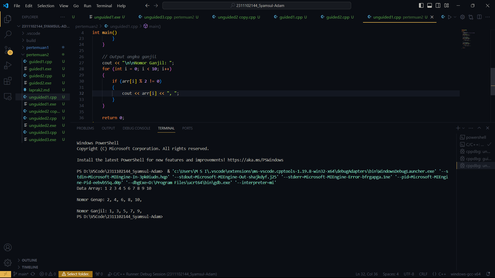

# <h1 align="center">Laporan Praktikum Modul-1 Tipe Data</h1>
<p align="center">Syamsul Adam 2311102144</p>

## Dasar Teori

1. Array 1 dimensi adalah tipe variabel yang terdiri dari kumpulan data dengan tipe yang sama yang disusun dalam satu baris atau satu dimensi
Setiap elemen di dalam array memiliki indeks atau nomor yang digunakan untuk mengakses elemen tersebut. Indeks dimulai dari 0 dan berakhir pada jumlah elemen dikurangi satu. Contohnya, sebuah array satu dimensi yang berisi bilangan bulat {1, 2, 3, 4, 5} memiliki lima elemen dan indeksnya dimulai dari 0. Indeks 0 Merujuk pada elemen pertama, indeks 1 Merujuk pada elemen kedua, dan seterusnya hingga indeks 4 merujuk pada elemen kelima

2. Array 2 dimensi adalah sebuah array yang penomoran indeksnya menggunakan 2 angka yaitu satu untuk baris dan satu lagi untuk kolom, atau sebenarnya array 2 multidimensi. Dalam array 2 multidimensi, hal tersebut diperbolehkan. Ketika visualisasikan ke dalam sebuah tabel seperti di bawah ini:
    0 1 2 3
    0 1 2 3
    0 1 2 3
    0 1 2 3

Visualisasi untuk array b:
    0 1 2 3
    1 5 6 7
    2 7 8 9
    6 7 8 9

Ukuran baris dan kolom array 2 dimensi seringkali disebut dengan nama "jumlah baris" dan "jumlah kolom"
Untuk mengetahui ukuran atau panjang, bisa menggunakan atribut length pada array. Cara penggunaannya adalah sebagai berikut:
cpp
    int[][] a = new int[3][4];

Ketika dipanggil , hasilnya adalah 3 (jumlah baris), sedangkan ketika dipanggil , hasilnya adalah 4 (jumlah kolom)a.lengtha.length

3. Array Multidimensi
Array multidimensi adalah bentuk kompleks dari array 2 dimensi, seperti pada konsep sebelumnya array 2 dimensi adalah kumpulan dari array 1 dimensi
Contoh penerapan array 3 dimensi adalah pada gambar berwarna RGB (Red Green Blue). Visualisasinya ada di bawah ini:
Dari visualisasi di atas terlihat setiap gambar memiliki 3 channel atau layer yaitu RGB (Red, Green, dan Blue), 3 channel tersebut yang merepresentasikan array 3 dimensi. Setiap channel, RGB direpresentasikan array 2 dimensi. Jadi sudah sesuai dengan konsep array 3 dimensi bahwa merupakan kumpulan dari array 2 dimensi[2].

Untuk deklarasi array 3 dimensi, dapat menggunakan kurung siku [][][] atau subskrip menjadi 3. Secara umum deklarasinya adalah:
cpp
    data_type[][][] array_name = new data_type[x][y][z];

Untuk inisialisasi array 3 dimensi, dapat menggunakan representasi array 2D. Atau secara umum dapat disajikan seperti di bawah ini:
cpp
    array_name[array_index][baris][kolom] = value;

Contoh:
    cpp
    int[][][] arr = new int;
    arr[0][0][0] = 1;

Dalam penggunaan array multidimensi, dapat menggunakan looping atau perulangan pada saat perubahan jumlah baris dan kolomnya


## Guided 

### 1. [Program Input Array Tiga Dimensi]

```C++
#include <iostream>
using namespace std;

int main()
{
    // Deklarasi array
    int arr[2][3][3];

    // Input elemen
    for (int x = 0; x < 2; x++)
    {
        for (int y = 0; y < 3; y++)
        {
            for (int z = 0; z < 3; z++)
            {
                cout << "Input Array[" << x << "][" << y << "][" << z << "] = ";
                cin >> arr[x][y][z];
            }
        }
        cout << endl;
    }

    // Output Array
    for (int x = 0; x < 2; x++)
    {
        for (int y = 0; y < 3; y++)
        {
            for (int z = 0; z < 3; z++)
            {
                cout << "Data Array[" << x << "][" << y << "][" << z << "] = " << arr[x][y][z] << endl;
            }
        }
    }

    cout << endl;

    // Tampilan array
    for (int x = 0; x < 2; x++)
    {
        for (int y = 0; y < 3; y++)
        {
            for (int z = 0; z < 3; z++)
            {
                cout << arr[x][y][z] << " ";
            }
            cout << endl;
        }
        cout << endl;
    }

    return 0;
}
```
Program ini adalah program C++ yang menggunakan array tiga dimensi yang terdiri dari dua baris, tiga kolom, dan tiga lapisan. Arraynya dideklarasikan sebagaiUntuk menginput elemen array, program ini menggunakan perulangan, yang dimulai dari indeks 0 hingga 1 untuk baris, 0 hingga 2 untuk kolom, dan 0 hingga 2 untuk layer. 

### 2. [Program Mencari Nilai Maksimal pada Array]
```C++
#include <iostream>
using namespace std;

int main() {
    int maks, a, i, lokasi;

    cout << "Masukkan panjang array: ";
    cin >> a;

    int array[a];

    cout << "Masukkan " << a << " angka:\n";
    for (i = 0; i < a; i++) {
        cout << "Array ke-" << (i + 1) << ": ";
        cin >> array[i];
    }

    maks = array[0];
    lokasi = 0;
    for (i = 0; i < a; i++) {
        if (array[i] > maks) {
            maks = array[i];
            lokasi = i;
        }
    }

    cout << "Nilai maksimum adalah " << maks << " berada di Array ke " << lokasi + 1 << endl;

    return 0;
}

```
Program ini menginputkan array panjang dan menginputkan angka-angka yang diinginkan. Program mencari nilai maksimal dari array tersebut dan menampilkan nilai tersebut bersama dengan lokasi array tersebut.


## Unguided 

### 1. [Buatlah program untuk menampilkan Output seperti berikut dengan data yang diinputkan oleh user]

```C++
#include <iostream>
using namespace std;

int main()
{
    // Deklarasi array
    int arr[10] = {1, 2, 3, 4, 5, 6, 7, 8, 9, 10};

    // Output Array
    cout << "Data Array: ";
    for (int i = 0; i < 10; i++)
    {
        cout << arr[i] << " ";
    }

    // Output angka genap
    cout << "\n\nNomor Genap: ";
    for (int i = 0; i < 10; i++)
    {
        if (arr[i] % 2 == 0)
        {
            cout << arr[i] << ", ";
        }
    }

    // Output angka ganjil
    cout << "\n\nNomor Ganjil: ";
    for (int i = 0; i < 10; i++)
    {
        if (arr[i] % 2 != 0)
        {
            cout << arr[i] << ", ";
        }
    }

    return 0;
}

//ini adalah program C++ sederhana yang menampilkan beberapa output dari suatu array yang telah diinisialisasi. Program ini memiliki sebuah array arryang telah diinisialisasi dengan 10 elemen yang berisi angka dari 1 sampai 10. Program akan menampilkan data dari array tersebut, lalu akan menampilkan daftar dari angka genap dan angka ganjil yang ada dalam array tersebut.
```
#### Output:



### 2. [Buatlah program Input array tiga dimensi (seperti pada guided) tetapi jumlah atau ukuran elemennya diinputkan oleh user!]
```C++
#include <iostream> 
using namespace std; 

int main() { 
    int a, d, m; 
    cout << "Masukkan jumlah matriks: "; 
    cin >> a; 
    cout << "Masukkan ukuran matriks (y z): "; 
    cin >> d >> m; 
    
    int arr[a][d][m]; 
    //Input elemen 
    for (int i = 0; i < a; i++) { 
        for (int j = 0; j < d; j++) { 
            for (int k = 0; k < m; k++) { 
                cout << "Input Array[" << i << "][" << j << "][" << k << "] = "; 
                cin >> arr[i][j][k]; 
            } 
        } 
        cout << endl; 
    } 
    //Output Array 
    for (int i = 0; i < a; i++) { 
        for (int j = 0; j < d; j++) { 
            for (int k = 0; k < m; k++) { 
                cout << "Data Array[" << i << "][" << j << "][" << k << "] = " << arr[i][j][k] << endl; 
            }
            
        } 
    }
    cout << endl; 
    //Tampilan array 
    for (int i = 0; i < a; i++) { 
        cout << "Matriks ke-" << i+1 << ":" << endl; 
        for (int j = 0; j < d; j++) { 
            for (int k = 0; k < m; k++) { 
                cout << arr[i][j][k] << " "; 
            } 
             cout << endl; 
        } 
        cout << endl; 
    } 
    return 0; 
}

//Program C++ ini membuat array 3D dengan dimensi yang ditentukan oleh input pengguna. Program ini pertama-tama meminta pengguna untuk memasukkan jumlah elemen dalam array 3D. Kemudian menghitung dimensi array berdasarkan masukan, memastikan bahwa dimensinya sama. Jika input tidak valid, program akan mencetak pesan kesalahan dan keluar. Program kemudian mendeklarasikan array 3D dengan dimensi yang dihitung dan meminta pengguna untuk memasukkan elemen array satu per satu. Elemen-elemen tersebut dimasukkan dalam urutan baris-mayor, yaitu pertama semua elemen pada baris pertama, kemudian semua elemen pada baris kedua, dan seterusnya.
```
#### Output:


### 3. [Buatlah program menu untuk mencari nilai Maksimum, Minimum dan Nilai rata – rata dari suatu array dengan input yang dimasukan oleh user!]

```C++
#include <iostream>

using namespace std;

int main() {
    const int SIZE = 10;
    int arr[SIZE];
    int sum = 0;
    int max = INT_MIN;
    int min = INT_MAX;

    cout << "Masukkan " << SIZE << " elemen array: ";
    for (int i = 0; i < SIZE; i++) {
        cin >> arr[i];
        sum += arr[i];
        if (arr[i] > max) {
            max = arr[i];
        }
        if (arr[i] < min) {
            min = arr[i];
        }
    }

    cout << "Nilai maksimum: " << max << endl;
    cout << "Nilai minimum: " << min << endl;
    cout << "Nilai rata-rata: " << (float)sum / SIZE << endl;

    return 0;
}

//Program ini merupakan program yang meminta pengguna untuk menginputkan 10 elemen array. Setelah menginputkan elemen-elemen array, program akan menghitung nilai maksimum, nilai minimum, dan rata-rata dari elemen-elemen array tersebut. Nilai maksimum dan nilai minimum akan disimpan dalam variabel max dan min yang diinisialisasi dengan nilai minimum dan maksimum integer. Setelah menginputkan elemen array, program akan menampilkan nilai maksimum, nilai minimum, dan rata-rata dari elemen array tersebut.

```

#### Output:


## Kesimpulan
Program ini merupakan program yang memiliki beberapa fungsionalitas. Pertama, program ini membuat array 1D yang berisi angka dari 1 sampai 10. Kemudian, program akan menampilkan data dari array tersebut, lalu akan menampilkan daftar dari angka genap dan angka ganjil yang ada dalam array tersebut. Selanjutnya, program ini membuat array 3D dengan dimensi yang ditentukan oleh input pengguna. Program ini akan menghitung dimensi array berdasarkan masukan, memastikan bahwa dimensinya sama. Jika input tidak valid, program akan mencetak pesan kesalahan dan keluar. Program kemudian mendeklarasikan array 3D dengan dimensi yang dihitung dan meminta pengguna untuk memasukkan elemen array satu per satu. Elemen-elemen tersebut dimasukkan dalam urutan baris-mayor, yaitu pertama semua elemen pada baris pertama, kemudian semua elemen pada baris kedua, dan seterusnya. Terakhir, program ini membuat array 1D dengan 10 elemen dan menghitung nilai maksimum, nilai minimum, dan rata-rata dari elemen-elemen array tersebut. Nilai maksimum dan nilai minimum akan disimpan dalam variabel max dan min yang diinisialisasi dengan nilai minimum dan maksimum integer. Setelah menginputkan elemen array, program akan menampilkan nilai maksimum, nilai minimum, dan rata-rata dari elemen array tersebut.

## Referensi
[1] https://laskar21.blogspot.com/2016/09/pengertian-array-1-dimensi-dan-2-dimensi.html?m=1