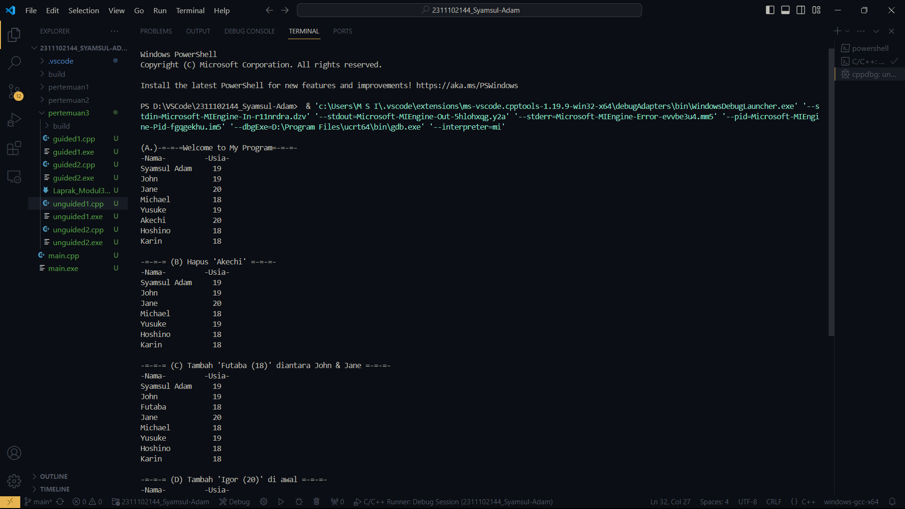
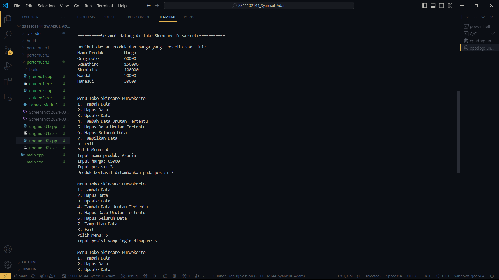

# <h1 align="center">Laporan Praktikum Modul 3 - Linked List</h1>
<p align="center">Syamsul Adam- 2311102144</p>

## Dasar Teori
Linked List
 
1. Single Linked List : Single linked list adalah suatu jenis linked list yang hanya memiliki satu pointer yang menghubungkan setiap node. Setiap node hanya memiliki satu pointer yang menunjuk ke node berikutnya. Ini memungkinkan traversal hanya dalam satu arah, yaitu dari node pertama ke node terakhir. Single linked list lebih efisien dalam penggunaan memori, tetapi tidak memungkinkan reverse traversal.


2. Double Linked List : Double linked list adalah suatu jenis linked list yang memiliki pointer kedua, yaitu pointer ke node sebelumnya dan pointer ke node berikutnya. Ini memungkinkan traversal dalam dua arah, yaitu dari node pertama ke node terakhir, serta dari node terakhir ke node pertama. Double linked list lebih efisien dalam penggunaan saat melakukan reverse traversal, namun membutuhkan lebih banyak memori.


Kedua jenis linked list ini memiliki beberapa operasi dasar, seperti traversal, insertion, deletion, searching, dan sorting. Operasi-operasi ini dapat dilakukan dengan mudah dalam linked list.

## Guided 

### 1. [Latihan Single Linked List]

```C++
#include <iostream>
using namespace std;

//PROGRAM SINGLE LINKED LIST NON-CIRCULAR

//Deklarasi Struct Node
struct Node{
    int data;
    Node *next;
};

Node *head;
Node *tail;

//Inisialisasi Node
void init(){
    head = NULL;
    tail = NULL;
}

// Pengecekan
bool isEmpty(){
    if (head == NULL)
        return true;
    else
        return false;
}

//Tambah Depan
void insertDepan(int nilai){
    //Buat Node baru
    Node *baru = new Node;
    baru->data = nilai;
    baru->next = NULL;
    if (isEmpty() == true){
        head = tail = baru;
        tail->next = NULL;
    }
    else{
        baru->next = head;
        head = baru;
    }
}

//Tambah Belakang
void insertBelakang(int nilai){
    //Buat Node baru
    Node *baru = new Node;
    baru->data = nilai;
    baru->next = NULL;
    if (isEmpty() == true){
        head = tail = baru;
        tail->next = NULL;
    }
    else{
        tail->next = baru;
        tail = baru;
    }
}

//Hitung Jumlah List
int hitungList(){
    Node *hitung;
    hitung = head;
    int jumlah = 0;
    while( hitung != NULL ){
        jumlah++;
        hitung = hitung->next;
    }
    return jumlah;
}

//Tambah Tengah
void insertTengah(int data, int posisi){
    if( posisi < 1 || posisi > hitungList() ){
        cout << "Posisi diluar jangkauan" << endl;
    }
    else if( posisi == 1){
        cout << "Posisi bukan posisi tengah" << endl;
    }
    else{
        Node *baru, *bantu;
        baru = new Node();
        baru->data = data;
        // tranversing
        bantu = head;
        int nomor = 1;
        while( nomor < posisi - 1 ){
            bantu = bantu->next;
            nomor++;
        }
        baru->next = bantu->next;
        bantu->next = baru;
    }
}

//Hapus Depan
void hapusDepan() {
    Node *hapus;
    if (isEmpty() == false){
        if (head->next != NULL){
            hapus = head;
            head = head->next;
            delete hapus;
        }
        else{
            head = tail = NULL;
        }
    }
    else{
        cout << "List kosong!" << endl;
    }
}

//Hapus Belakang
void hapusBelakang() {
    Node *hapus;
    Node *bantu;
    if (isEmpty() == false){
        if (head != tail){
            hapus = tail;
            bantu = head;
            while (bantu->next != tail){
                bantu = bantu->next;
            }
            tail = bantu;
            tail->next = NULL;
            delete hapus;
        }
        else{
            head = tail = NULL;
        }
    }
    else{
        cout << "List kosong!" << endl;
    }
}

//Hapus Tengah
void hapusTengah(int posisi){
    Node *hapus, *bantu, *bantu2;
    if( posisi < 1 || posisi > hitungList() ){
        cout << "Posisi di luar jangkauan" << endl;
    }
    else if( posisi == 1){
        cout << "Posisi bukan posisi tengah" << endl;
    }
    else{
        int nomor = 1;
        bantu = head;
        while( nomor <= posisi ){
            if( nomor == posisi-1 ){
                bantu2 = bantu;
            }
            if( nomor == posisi ){
                hapus = bantu;
            }
            bantu = bantu->next;
            nomor++;
        }
        bantu2->next = bantu;
        delete hapus;
    }
}

//Ubah Depan
void ubahDepan(int data){
    if (isEmpty() == false){
        head->data = data;
    }
    else{
        cout << "List masih kosong!" << endl;
    }
}

//Ubah Tengah
void ubahTengah(int data, int posisi){
    Node *bantu;
    if (isEmpty() == false){
        if( posisi < 1 || posisi > hitungList() ){
            cout << "Posisi di luar jangkauan" << endl;
        }
        else if( posisi == 1){
            cout << "Posisi bukan posisi tengah" << endl;
        }
        else{
            bantu = head;
            int nomor = 1;
            while (nomor < posisi){
                bantu = bantu->next;nomor++;
            }
            bantu->data = data;
        }
    }
    else{
        cout << "List masih kosong!" << endl;
    }
}

//Ubah Belakang
void ubahBelakang(int data){
    if (isEmpty() == false){
tail->data = data;
}
  else{
cout << "List masih kosong!" << endl;
  }
}
//Hapus List
void clearList(){
Node *bantu, *hapus;
bantu = head;
while (bantu != NULL){
hapus = bantu;bantu = bantu->next;
delete hapus;
}
head = tail = NULL;
cout << "List berhasil terhapus!" << endl;
}
//Tampilkan List
void tampil(){
Node *bantu;
bantu = head;
if (isEmpty() == false){
while (bantu != NULL){
cout << bantu->data << ends;
bantu = bantu->next;
}
cout << endl;
}
else{
cout << "List masih kosong!" << endl;
}
}
int main(){
init();
insertDepan(3);tampil();
insertBelakang(5);
tampil();
insertDepan(2);
tampil();
insertDepan(1);
tampil();
hapusDepan();
tampil();
hapusBelakang();
tampil();
insertTengah(7,2);
tampil();
hapusTengah(2);
tampil();
ubahDepan(1);
tampil();
ubahBelakang(8);
tampil();
ubahTengah(11, 2);
tampil();
return 0;
}
```
Program di atas adalah program C++ yang menggunakan struct Node untuk menyimpan data dan pointer ke node berikutnya. Program mengimplementasikan beberapa fungsi untuk menangani linked list, seperti inisialisasi linked list, pengecekan linked list kosong, tambah depan, tambah belakang, hitung jumlah list, tambah tengah, hapus depan, hapus belakang, hapus tengah, ubah depan, ubah tengah, ubah belakang, hapus list, dan tampilkan list.

### 2. [Latihan Double Linked List Source ]

```C++
#include <iostream>
using namespace std;

class Node {
public:
    int data;
    Node* prev;
    Node* next;
};

class DoublyLinkedList {
public:
    Node* head;
    Node* tail;
    DoublyLinkedList() {
        head = nullptr;
        tail = nullptr;
    }
    void push(int data) {
        Node* newNode = new Node;
        newNode->data = data;
        newNode->prev = nullptr;
        newNode->next = head;
        if (head != nullptr) {
            head->prev = newNode;
        }
        else {
            tail = newNode;
        }
        head = newNode;
    }
    void pop() {
        if (head == nullptr) {
            return;
        }
        Node* temp = head;
        head = head->next;
        if (head != nullptr) {
            head->prev = nullptr;
        }
        else {
            tail = nullptr;
        }
        delete temp;
    }
    bool update(int oldData, int newData) {
        Node* current = head;
        while (current != nullptr) {
            if (current->data == oldData) {
                current->data = newData;
                return true;
            }
            current = current->next;
        }
        return false;
    }
    void deleteAll() {
        Node* current = head;
        while (current != nullptr) {
            Node* temp = current;
            current = current->next;
            delete temp;
        }
        head = nullptr;
        tail = nullptr;
    }
    void display() {
        Node* current = head;
        while (current != nullptr) {
            cout << current->data << " ";
            current = current->next;
        }
        cout << endl;
    }
};

int main() {
    DoublyLinkedList list;
    while (true) {
        cout << "1. Add data" << endl;
        cout << "2. Delete data" << endl;
        cout << "3. Update data" << endl;
        cout << "4. Clear data" << endl;
        cout << "5. Display data" << endl;
        cout << "6. Exit" << endl;
        int choice;
        cout << "Enter your choice: ";
        cin >> choice;
        switch (choice) {
            case 1: {
                int data;
                cout << "Enter data to add: ";
                cin >> data;
                list.push(data);
                break;
            }
            case 2: {
                list.pop();
                break;
            }
            case 3: {
                int oldData, newData;
                cout << "Enter old data: ";
                cin >> oldData;
                cout << "Enter new data: ";
                cin >> newData;
                bool updated = list.update(oldData, newData);
                if (!updated) {
                    cout << "Data not found" << endl;
                }
                break;
            }
            case 4: {
                list.deleteAll();
                break;
            }
            case 5: {
                list.display();
                break;
            }
            case 6: {
                return 0;
            }
            default: {
                cout << "Invalid choice" << endl;
                break;
            }
        }
    }
    return 0;
}
```
Program ini mengimplementasikan class Double LinkedList yang mengatur linked list berdua arah. Class ini memiliki beberapa fungsi untuk menangani linked list, seperti push untuk menambah data, pop untuk menghapus data, update untuk mengupdate data, deleteAll untuk menghapus semua data, dan display untuk menampilkan data.

## Unguided 

### 1. [Buatlah menu program Single Linked List Non-Circular untuk menyimpan Nama dan Usia siswa, dengan menggunakan inputan dari pengguna. Lakukan operasi berikut:
a. Masukkan data sesuai urutan berikut.(Gunakan masukkan depan, belakang atau tengah). Data pertama yang dimasukkan adalah nama dan usia anda.
ㅤb. Hapus data Akechi
ㅤc. Tambahkan data berikut diantara John dan Jane: "Futaba 18"
ㅤd. Tambahkan data berikut di awal: "Igor 20"
ㅤe. Ubah data Michael menjadi: "Reyn 18"
ㅤf. Tampilkan seluruh data]

```C++
#include <iostream>
#include <iomanip>
using namespace std;

//Deklarasi Struct Node
struct Node {
    string nama144;
    int umur144;
    Node* next;
};

Node* head;
Node* tail;

//Inisialisasi Node
void node144() {
    head = NULL;
    tail = NULL;
}

// Pengecekan
bool Cek_144() {
    if (head == NULL)
        return true;
    else
        return false;
}

//Tambah Depan
void Depan_144(string name, int age) {
    //Buat Node baru
    Node* baru = new Node;
    baru->nama144 = name;
    baru->umur144 = age;
    baru->next = NULL;

    if (Cek_144() == true) {
        head = tail = baru;
        tail->next = NULL;
    }
    else {
        baru->next = head;
        head = baru;
    }
}

//Tambah Belakang
void Belakang_144(string name, int age) {
    //Buat Node baru
    Node* baru = new Node;
    baru->nama144 = name;
    baru->umur144 = age;
    baru->next = NULL;

    if (Cek_144() == true) {
        head = tail = baru;
        tail->next = NULL;
    }
    else {
        tail->next = baru;
        tail = baru;
    }
}

//Hitung Jumlah List
int jumlah144() {
    Node* hitung;
    hitung = head;
    int jumlah = 0;

    while (hitung != NULL) {
        jumlah++;
        hitung = hitung->next;
    }

    return jumlah;
}

//Tambah Tengah
void Tengah_144(string name, int age, int posisi) {
    if (posisi < 1 || posisi > jumlah144()) {
        cout << "Tidak terjangkau!" << endl;
    }
    else if (posisi == 1) {
        cout << "Bukan di tengah." << endl;
    }
    else {
        Node* baru, * bantu;
        baru = new Node();
        baru->nama144 = name;
        baru->umur144 = age;

        // tranversing
        bantu = head;
        int nomor = 1;

        while (nomor < posisi - 1) {
            bantu = bantu->next;
            nomor++;
        }

        baru->next = bantu->next;
        bantu->next = baru;
    }
}

//Hapus Depan
void Hapus_144() {
    Node* hapus;

    if (Cek_144() == false) {
        if (head->next != NULL) {
            hapus = head;
            head = head->next;
            delete hapus;
        }
        else {
            head = tail = NULL;
        }
    }
    else {
        cout << "Kosong!" << endl;
    }
}

//Hapus Belakang
void Hapusbelakang_144() {
    Node* hapus;
    Node* bantu;

    if (Cek_144() == false) {
        if (head != tail) {
            hapus = tail;
            bantu = head;

            while (bantu->next != tail) {
                bantu = bantu->next;
            }

            tail = bantu;
            tail->next = NULL;
            delete hapus;
        }
        else {
            head = tail = NULL;
        }
    }
    else {
        cout << "Kosong!" << endl;
    }
}

//Hapus Tengah
void hapustengah_144(int posisi) {
    Node* hapus, * bantu, * bantu2;

    if (posisi < 1 || posisi > jumlah144()) {
        cout << "Tidak terjangkau!" << endl;
    }
    else if (posisi == 1) {
        cout << "Bukan yang tengah." << endl;
    }
    else {
        int nomor = 1;
        bantu = head;

        while (nomor <= posisi) {
            if (nomor == posisi - 1) {
                bantu2 = bantu;
            }

            if (nomor == posisi) {
                hapus = bantu;
            }

            bantu = bantu->next;
            nomor++;
        }

        bantu2->next = bantu;
        delete hapus;
    }
}

//Ubah Depan
void ubahdepan_144(string name, int age) {
    if (Cek_144() == false) {
        head->nama144 = name;
        head->umur144 = age;
    }
    else {
        cout << "Tidak ada yang berubah!" << endl;
    }
}

//Ubah Tengah
void ubahtengah_144(string name, int age, int posisi) {
    Node* bantu;

    if (Cek_144() == false) {
        if (posisi < 1 || posisi > jumlah144()) {
            cout << "Tidak Terjangkau!" << endl;
        }
        else if (posisi == 1) {
            cout << "Bukan yang Tengah." << endl;
        }
        else {
            bantu = head;
            int nomor = 1;

            while (nomor < posisi) {
                bantu = bantu->next;
                nomor++;
            }

            bantu->nama144 = name;
            bantu->umur144 = age;
        }
    }
    else {
        cout << "Kosong!" << endl;
    }
}

//Ubah Belakang
void ubahbelakang_144(string name, int age) {
    if (Cek_144() == false) {
        tail->nama144 = name;
        tail->umur144 = age;
    }
    else {
        cout << "Kosong" << endl;
    }
}

//Hapus List
void hapuslist_144() {
    Node* bantu, * hapus;
    bantu = head;

    while (bantu != NULL) {
        hapus = bantu;
        bantu = bantu->next;
        delete hapus;
    }

    head = tail = NULL;
    cout << "Menghapus semua!" << endl;
}

//Tampilkan List
void Tampilist_144() {
    Node* bantu;
    bantu = head;

    cout << left << setw(15) << "-Nama-" << right << setw(4) << "-Usia-" << endl; // Supaya rapi

    if (Cek_144() == false) {
        while (bantu != NULL) {
            cout << left << setw(15) << bantu->nama144 << right << setw(4) << bantu->umur144 << endl; // Supaya lurus di output
            bantu = bantu->next;
        }

        cout << endl;
    }
    else {
        cout << "Kosong!" << endl;
    }
}

int main() {
    node144(); // Inisialisasi Linked List
    cout << "\n(A.)-=-=-=Welcome to My Program=-=-=-" << endl; // Menampilkan nama dan umur awal & menjawab poin a
    Depan_144("Karin", 18);
    Depan_144("Hoshino", 18);
    Depan_144("Akechi", 20);
    Depan_144("Yusuke", 19);
    Depan_144("Michael", 18);
    Depan_144("Jane", 20);
    Depan_144("John", 19);
    Depan_144("Syamsul Adam", 19);
    Tampilist_144();

    // Menjawab poin b
    cout << "-=-=-= (B) Hapus 'Akechi' =-=-=-" << endl;
    hapustengah_144(6);
    Tampilist_144();

    // Menjawab poin c
    cout << "-=-=-= (C) Tambah 'Futaba (18)' diantara John & Jane =-=-=-" << endl;
    Tengah_144("Futaba", 18, 3);
    Tampilist_144();

    // Menjawab poin d
    cout << "-=-=-= (D) Tambah 'Igor (20)' di awal =-=-=-" << endl;
    Depan_144("Igor", 20);
    Tampilist_144();

    // Menjawab poin e & f
    cout << "-=-=-= (E) Ubah 'Michael' menjadi 'Reyn (18)' =-=-=-" << endl;
    cout << "-=-=-= (F) Tampilan Akhir =-=-=-" << endl;
    ubahtengah_144("Reyn", 18, 6);
    Tampilist_144();

    return 0;
}
```
#### Output:

.png)

Program ini juga menggunakan fungsi main untuk melakukan operasi terhadap linked list. Fungsi main memanggil semua fungsi yang digunakan untuk menangani linked list. Program ini akan menampilkan output dari operasi yang dilakukan terhadap linked list.

### 2. [Modifikasi Guided Double Linked List dilakukan dengan penambahan operasi untuk menambah data, menghapus, dan memperbarui di tengah / di urutan tertentu yang diminta. Selain itu, buatlah agar tampilannya menampilkan Nama Produk dan Harga.  
Kasus:
ㅤ1. Tambahkan produk Azarine dengan harga 65000 diantara Somethinc dan Skintific
ㅤ2. Hapus produk Wardah
ㅤ3. Update produk Hanasui menjadi Cleora dengan harga 55000
ㅤ4. Tampilkan menu, di mana tampilan akhirnya akan menjadi seperti dibawah ini:
Toko Skincare Purwokerto
1.	Tambah Data
2.	Hapus Data
3.	Update Data
4.	Tambah Data Urutan Tertentu
5.	Hapus Data Urutan Tertentu
6.	Hapus Seluruh Data
7.	Tampilkan Data
8.	Exit
Pada menu 7, tampilan akhirnya akan menjadi seperti dibawah
ini :

```C++
#include <iostream>
#include <iomanip>
#include <string>
using namespace std;

class Node { // Class Node untuk Double Linked List
public:
    string Nama_Produk;
    int harga;
    Node* prev;
    Node* next;
};

class DoublyLinkedList { // Class DoublyLinkedList untuk Double Linked List
public:
    Node* head;
    Node* tail;
    DoublyLinkedList() {
        head = nullptr;
        tail = nullptr;
    }

    void Tambah144(string Nama_Produk, int harga) { // Menambahkan produk ke dalam linked list di bagian atas
        Node* newNode = new Node;
        newNode->Nama_Produk = Nama_Produk;
        newNode->harga = harga;
        newNode->prev = nullptr;
        newNode->next = head;
        if (head != nullptr) {
            head->prev = newNode;
        }
        else {
            tail = newNode;
        }
        head = newNode;
    }

    void Hapusproduk_144() { // Menghapus produk teratas dari linked list
        if (head == nullptr) {
            return;
        }
        Node* temp = head;
        head = head->next;
        if (head != nullptr) {
            head->prev = nullptr;
        }
        else {
            tail = nullptr;
        }
        delete temp;
    }

    bool Ubah_144(string Nama_Produk_Lama, string Nama_Produk_Baru, int Harga_Baru) { // Mengubah data produk berdasarkan nama produk
        Node* current = head;
        while (current != nullptr) {
            if (current->Nama_Produk == Nama_Produk_Lama) {
                current->Nama_Produk = Nama_Produk_Baru;
                current->harga = Harga_Baru;
                return true;
            }
            current = current->next;
        }
        return false;
    }

    void sisip_144(string Nama_Produk, int harga, int posisi) { // Menambahkan data produk pada posisi tertentu
        if (posisi < 1) {
            cout << "Posisi tidak ada" << endl;
            return;
        }
        Node* newNode = new Node;
        newNode->Nama_Produk = Nama_Produk;
        newNode->harga = harga;
        if (posisi == 1) { // Jika posisi adalah 1 maka tambahkan data produk di depan linked list
            newNode->next = head;
            newNode->prev = nullptr;
            if (head != nullptr) {
                head->prev = newNode;
            }
            else {
                tail = newNode;
            }
            head = newNode;
            return;
        }
        Node* current = head;
        for (int i = 1; i < posisi - 1 && current != nullptr; ++i) { // Looping sampai posisi sebelum posisi yang diinginkan (Posisi - 1)
            current = current->next;
        }
        if (current == nullptr) {
            cout << "Posisi tidak ada" << endl;
            return;
        }
        newNode->next = current->next;
        newNode->prev = current;
        if (current->next != nullptr) {
            current->next->prev = newNode; // Pointer prev node setelah current menunjuk ke newNode jika node setelah current tidak nullptr
        }
        else {
            tail = newNode;
        }
        current->next = newNode;
    }

    void Hapusposisi_144(int posisi) { // Menghapus data produk pada posisi tertentu
        if (posisi < 1 || head == nullptr) {
            cout << "Posisi tidak ada atau list kosong" << endl;
            return;
        }
        Node* current = head;
        if (posisi == 1) {
            head = head->next;
            if (head != nullptr) {
                head->prev = nullptr;
            }
            else {
                tail = nullptr;
            }
            delete current;
            return;
        }
        for (int i = 1; current != nullptr && i < posisi; ++i) { // Looping sampai posisi yang diinginkan
            current = current->next;
        }
        if (current == nullptr) {
            cout << "Posisi tidak ada" << endl;
            return;
        }
        if (current->next != nullptr) {
            current->next->prev = current->prev;
        }
        else {
            tail = current->prev;
        }
        current->prev->next = current->next;
        delete current;
    }

    void Hapusemua_144() { // Menghapus semua data produk
        Node* current = head;
        while (current != nullptr) {
            Node* temp = current;
            current = current->next;
            delete temp;
        }
        head = nullptr;
        tail = nullptr;
    }

    void tampilan_144() { // Menampilkan data produk
        Node* current = head;
        cout << "\nBerikut daftar Produk dan harga yang tersedia saat ini:" << endl;
        cout << left << setw(20) << "Nama Produk" << "Harga" << endl;
        while (current != nullptr) {
            cout << left << setw(20) << current->Nama_Produk << current->harga << endl;
            current = current->next;
        }
        cout << endl;
    }
};

int main() {
    DoublyLinkedList list; // Deklarasi objek list dari class DoublyLinkedList

    list.Tambah144("Hanasui", 30000);
    list.Tambah144("Wardah", 50000);
    list.Tambah144("Skintific", 100000);
    list.Tambah144("Somethinc", 150000);
    list.Tambah144("Originote", 60000);

    cout << "\n==========Selamat datang di Toko Skincare Purwokerto===========" << endl;
    list.tampilan_144();

    while (true) { // Looping menu utama
        cout << "\nMenu Toko Skincare Purwokerto" << endl;
        cout << "1. Tambah Data" << endl;
        cout << "2. Hapus Data" << endl;
        cout << "3. Update Data" << endl;
        cout << "4. Tambah Data Urutan Tertentu" << endl;
        cout << "5. Hapus Data Urutan Tertentu" << endl;
        cout << "6. Hapus Seluruh Data" << endl;
        cout << "7. Tampilkan Data" << endl;
        cout << "8. Exit" << endl;
        int pilihan;
        cout << "Pilih Menu: ";
        cin >> pilihan;
        switch (pilihan) { // Switch case untuk memilih menu
        case 1: {
            string Nama_Produk;
            int harga;
            cout << "Masukkan nama produk: ";
            cin >> Nama_Produk;
            cout << "Masukkan harga: ";
            cin >> harga;
            list.Tambah144(Nama_Produk, harga); // Memanggil fungsi tambah_produk
            cout << "Produk berhasil ditambahkan teratas" << endl;
            break;
        }
        case 2: {
            list.Hapusproduk_144(); // Memanggil fungsi hapus_produk
            cout << "Produk teratas berhasil dihapus" << endl;
            break;
        }
        case 3: {
            string Nama_Produk_Lama, Nama_Produk_Baru;
            int Harga_Baru;
            cout << "Input nama produk lama: ";
            cin >> Nama_Produk_Lama;
            cout << "Input nama produk baru: ";
            cin >> Nama_Produk_Baru;
            cout << "Input harga baru: ";
            cin >> Harga_Baru;
            bool updated = list.Ubah_144(Nama_Produk_Lama, Nama_Produk_Baru, Harga_Baru); // Memanggil fungsi ubah_produk
            if (!updated) {
                cout << "Data produk tidak ditemukan" << endl;
            }
            else {
                cout << "Data produk berhasil diupdate" << endl;
            }
            break;
        }
        case 4: {
            string Nama_Produk;
            int harga, position;
            cout << "Input nama produk: ";
            cin >> Nama_Produk;
            cout << "Input harga: ";
            cin >> harga;
            cout << "Input posisi: ";
            cin >> position;
            list.sisip_144(Nama_Produk, harga, position); // Memanggil fungsi sisipkan_posisi_tertentu
            cout << "Produk berhasil ditambahkan pada posisi " << position << endl;
            break;
        }
        case 5: {
            int position;
            cout << "Input posisi yang ingin dihapus: ";
            cin >> position;
            list.Hapusposisi_144(position); // Memanggil fungsi hapus_posisi_tertentu

            break;
        }
        case 6: {
            list.Hapusemua_144(); // Memanggil fungsi hapus_semua
            break;
        }
        case 7: {
            list.tampilan_144(); // Memanggil fungsi display
            break;
        }
        case 8: {
            return 0;
        }
        default: {
            cout << "Input Invalid" << endl;
            break;
        }
        }
    }
    return 0;
}
```
#### Output:

.png)

Program ini menggunakan daftar linked list untuk menyimpan nama dan harga produk. Pengguna dapat melakukan berbagai operasi seperti menambah produk, menghapus produk, memperbarui detail produk, memasukkan produk pada posisi tertentu, dan menghapus produk pada posisi tertentu. Program ini menampilkan daftar produk dengan harga masing-masing, dan pengguna dapat memilih opsi menu menggunakan pernyataan switch-case. Program berjalan berulang-ulang hingga pengguna memilih opsi keluar.

## Kesimpulan
Praktikum SINGLEANDDOUBLELINKEDLIST menunjukkan bahwa linked list adalah struktur data yang paling dasar yang terdiri dari sejumlah unsur-unsur yang terhubung secara dinamis. Linked list dapat berbentuk single linked list atau double linked list, berdasarkan kebutuhan aplikasi. Double linked list dapat digunakan untuk menyimpan data yang dinamis dan tidak diketahui pada saat kompilasi, sehingga lebih efisien dalam melakukan operasi seperti penyisipan, penghapusan, dan pengubahan data. Double linked list membutuhkan banyak method untuk mengoperasikannya, sehingga perlu diperhatikan dalam pengembangan aplikasi. Double linked list dapat digunakan untuk menyimpan data yang dinamis, sehingga lebih efektif dalam melakukan operasi data.

## Referensi
[1]https://youtu.be/nFIM68I7_98