# <h1 align="center">Laporan Praktikum Modul-1 Tipe Data</h1>
<p align="center">Syamsul Adam 2311102144</p>

## Dasar Teori

Dasar teori Linked List Non Circular dan Linked List Circular adalah sebagai berikut:
Single Linked List Non Circular:
Single Linked List Non Circular adalah sekumpulan dari node yang saling terhubung dengan node lain melalui sebuah pointer.
Hanya memiliki satu arah dan tidak memiliki dua arah atau bulak balik (dua arah disebut double linked list).
Fungsi dari linked list adalah untuk menyimpan data dengan struktur yang dapat secara otomatis menciptakan suatu tempat baru untuk menyimpan data yang diperlukan.
Perbedaan dengan array adalah bahwa linked list merupakan sekumpulan data yang berisi urutan elemen dalam strukturnya, sedangkan array adalah kumpulan objek data yang mirip satu sama lain dan disimpan di lokasi memori secara berurutan.
Contoh program dapat dilihat di sumber
1
.
Circular Linked List:
Circular Linked List adalah suatu linked list yang tidak memiliki nilai nil/NULL untuk medan sambungannya.
Terdiri dari dua jenis: Circular Single Linked List (Gambar 3.1) dan Circular Double Linked List (Gambar 3.2).
Operasi-operasi yang ada pada Circular Single Linked List sama seperti pada Single Linked List, yaitu penciptaan, penyisipan, penghapusan, dan penghubung.
Deklarasi dan operasi dapat dilihat di sumber
Dalam kesempatan ini, kami akan mencoba menjelaskan dasar teori Linked List Non Circular dan Linked List Circular.
1. Linked List Non Circular:
Linked List Non Circular adalah sekumpulan dari node yang saling terhubung dengan node lain melalui sebuah pointer. Setiap node memiliki satu pointer yang menunjuk ke node selanjutnya. Struktur ini memiliki beberapa keunggulan, seperti:
Efisien: Linked List Non Circular dapat mempermudah pengelolaan data, karena tidak perlu memiliki array yang dapat menyimpan beberapa data.
Dinamis: Linked List Non Circular dapat menyesuaikan ukuran yang diperlukan, karena setiap node hanya memiliki satu pointer yang menunjuk ke node selanjutnya.
Flexibilitas: Linked List Non Circular dapat digunakan untuk berbagai macam aplikasi, seperti pengelolaan data pada sistem operasi, pengelolaan data pada sistem database, dan lain sebagainya.
2. Linked List Circular:
Linked List Circular adalah sekumpulan node yang saling terhubung dengan node lain melalui sebuah pointer. Setiap node memiliki satu pointer yang menunjuk ke node selanjutnya, dan pointer terakhir menunjuk ke node pertama. Struktur ini memiliki beberapa keunggulan, seperti:
Efisien: Linked List Circular dapat menyesuaikan ukuran yang diperlukan, karena setiap node hanya memiliki satu pointer yang menunjuk ke node selanjutnya.
Flexibilitas: Linked List Circular dapat digunakan untuk berbagai macam aplikasi, seperti pengelolaan data pada sistem operasi, pengelolaan data pada sistem database, dan lain sebagainya.
Efisiensi penyimpanan: Linked List Circular dapat menjamin bahwa data akan selalu tersedia, karena pointer terakhir menunjuk ke node pertama.

Contoh Program:
Contoh program untuk menampilkan dasar teori Linked List Non Circular dan Linked List Circular dapat dilihat di sumber
Program ini menggunakan bahasa pemrograman C++ dan menggambarkan struktur Linked List Non Circular dan Linked List Circular.
## Guided 

### 1. [Linked List Non Circular]

```C++
#include <iostream>
using namespace std;
/// PROGRAM SINGLE LINKED LIST NON-CIRCULAR
// Deklarasi Struct Node
struct Node
{
    int data;
    Node *next;
};
Node *head;
Node *tail;
// Inisialisasi Node
void init()
{
    head = NULL;
    tail = NULL;
}
// Pengecekan
bool isEmpty()
{
    if (head == NULL)
        return true;
    else
        return false;
}
// Tambah Depan
void insertDepan(int nilai)
{
    // Buat Node baru
    Node *baru = new Node;
    baru->data = nilai;
    baru->next = NULL;
    if (isEmpty() == true)
    {
        head = tail = baru;
        tail->next = NULL;
    }
    else
    {
        baru->next = head;
        head = baru;
    }
}
// Tambah Belakang
void insertBelakang(int nilai)
{
    // Buat Node baru
    Node *baru = new Node;
    baru->data = nilai;
    baru->next = NULL;
    if (isEmpty() == true)
    {
        head = tail = baru;
        tail->next = NULL;
    }
    else
    {
        tail->next = baru;
        tail = baru;
    }
}
// Hitung Jumlah List
int hitungList()
{
    Node *hitung;
    hitung = head;
    int jumlah = 0;
    while (hitung != NULL)
    {
        jumlah++;
        hitung = hitung->next;
    }
    return jumlah;
}
// Tambah Tengah
void insertTengah(int data, int posisi)
{
    if (posisi < 1 || posisi > hitungList())
    {
        cout << "Posisi diluar jangkauan" << endl;
    }
    else if (posisi == 1)
    {
        cout << "Posisi bukan posisi tengah" << endl;
    }
    else
    {
        Node *baru, *bantu;
        baru = new Node();
        baru->data = data;
        // tranversing
        bantu = head;
        int nomor = 1;
        while (nomor < posisi - 1)
        {
            bantu = bantu->next;
            nomor++;
        }
        baru->next = bantu->next;
        bantu->next = baru;
    }
}
// Hapus Depan
void hapusDepan()
{
    Node *hapus;
    if (isEmpty() == false)
    {
        if (head->next != NULL)
        {
            hapus = head;
            head = head->next;
            delete hapus;
        }
        else
        {
            head = tail = NULL;
        }
    }
    else
    {
        cout << "List Kosong" << endl;
    }
}
// Hapus Belakang
void hapusBelakang()
{
    Node *hapus;
    Node *bantu;
    if (isEmpty() == false)
    {
        if (head != tail)
        {
            hapus = tail;
            bantu = head;
            while (bantu->next != tail)
            {
                bantu = bantu->next;
            }
            tail = bantu;
            tail->next = NULL;
            delete hapus;
        }
        else
        {
            head = tail = NULL;
        }
    }
    else
    {
        cout << "List kosong!" << endl;
    }
}
// Hapus Tengah
void hapusTengah(int posisi)
{
    Node *bantu, *hapus, *sebelum;
    if (posisi < 1 || posisi > hitungList())
    {
        cout << "Posisi di luar jangkauan" << endl;
    }
    else if (posisi == 1)
    {
        cout << "Posisi bukan posisi tengah" << endl;
    }
    else
    {
        int nomor = 1;
        bantu = head;
        while (nomor <= posisi)
        {
            if (nomor == posisi - 1)
            {
                sebelum = bantu;
            }
            if (nomor == posisi)
            {
                hapus = bantu;
            }
            bantu = bantu->next;
            nomor++;
        }
        sebelum->next = bantu;
        delete hapus;
    }
}
// Ubah Depan
void ubahDepan(int data)
{
    if (isEmpty() == 0)
    {
        head->data = data;
    }
    else
    {
        cout << "List masih kosong!" << endl;
    }
}
// Ubah Tengah
void ubahTengah(int data, int posisi)
{
    Node *bantu;
    if (isEmpty() == 0)
    {
        if (posisi < 1 || posisi > hitungList())
        {
            cout << "Posisi di luar jangkauan" << endl;
        }
        else if (posisi == 1)
        {
        }
        else
        {
            cout << "Posisi bukan posisi tengah" << endl;
            bantu = head;
            int nomor = 1;
            while (nomor < posisi)
            {
                bantu = bantu->next;
                nomor++;
            }
            bantu->data = data;
        }
    }
    else
    {
        cout << "List masih kosong!" << endl;
    }
}
// Ubah Belakang
void ubahBelakang(int data)
{
    if (isEmpty() == 0)
    {
        tail->data = data;
    }
    else
    {
        cout << "List masih kosong!" << endl;
    }
}
// Hapus List
void clearList()
{
    Node *bantu, *hapus;
    bantu = head;
    while (bantu != NULL)
    {
        hapus = bantu;
        bantu = bantu->next;
        delete hapus;
    }
    head = tail = NULL;
    cout << "List berhasil terhapus!" << endl;
}
// Tampilkan List
void tampil()
{
    Node *bantu;
    bantu = head;
    if (isEmpty() == false)
    {
        while (bantu != NULL)
        {
            cout << bantu->data << ends;
            bantu = bantu->next;
        }
        cout << endl;
    }
    else
    {
        cout << "List masih kosong!" << endl;
    }
}
int main()
{
    init();
    insertDepan(3);
    tampil();
    insertBelakang(5);
    tampil();
    insertDepan(2);
    tampil();
    insertDepan(1);
    tampil();
    hapusDepan();
    tampil();
    hapusBelakang();
    tampil();
    insertTengah(7, 2);
    tampil();
    hapusTengah(2);
    tampil();
    ubahDepan(1);
    tampil();
    ubahBelakang(8);
    tampil();
    ubahTengah(11, 2);
    tampil();
    return 0;
}
```
Program ini adalah program yang mengimplementasikan linked list single non-circular. Program ini menggunakan struct Node yang memiliki dua elemen: data dan next. Data digunakan untuk menyimpan nilai elemen, sedangkan next digunakan untuk menyimpan alamat elemen berikutnya dalam linked list.
Program ini menyediakan beberapa fungsi untuk mengelola linked list.

### 2. [Linked List Circular]
```C++
#include <iostream>
using namespace std;

// Deklarasi Struct Node
struct Node
{
    string data;
    Node* next;
};

Node* head, * tail, * baru, * bantu, * hapus;

void init()
{
    head = NULL;
    tail = head;
}

// Pengecekan
int isEmpty()
{
    if (head == NULL)
        return 1; // true
    else
        return 0; // false
}

// Buat Node Baru
void buatNode(string data)
{
    baru = new Node;
    baru->data = data;
    baru->next = NULL;
}

// Hitung List
int hitungList()
{
    bantu = head;
    int jumlah = 0;
    while (bantu != NULL)
    {
        jumlah++;
        bantu = bantu->next;
    }
    return jumlah;
}

// Tambah Depan
void insertDepan(string data)
{
    // Buat Node baru
    buatNode(data);

    if (isEmpty() == 1)
    {
        head = baru;
        tail = head;
        baru->next = head;
    }
    else
    {
        while (tail->next != head)
        {
            tail = tail->next;
        }
        baru->next = head;
        head = baru;
        tail->next = head;
    }
}

// Tambah Belakang
void insertBelakang(string data)
{
    // Buat Node baru
    buatNode(data);

    if (isEmpty() == 1)
    {
        head = baru;
        tail = head;
        baru->next = head;
    }
    else
    {
        while (tail->next != head)
        {
            tail = tail->next;
        }
        tail->next = baru;
        baru->next = head;
    }
}

// Tambah Tengah
void insertTengah(string data, int posisi)
{
    if (isEmpty() == 1)
    {
        head = baru;
        tail = head;
        baru->next = head;
    }
    else
    {
        baru->data = data;
        // transversing
        int nomor = 1;
        bantu = head;
        while (nomor < posisi - 1)
        {
            bantu = bantu->next;
            nomor++;
        }
        baru->next = bantu->next;
        bantu->next = baru;
    }
}

// Hapus Depan
void hapusDepan()
{
    if (isEmpty() == 0)
    {
        hapus = head;
        tail = head;
        if (hapus->next == head)
        {
            head = NULL;
            tail = NULL;
            delete hapus;
        }
        else
        {
            while (tail->next != hapus)
            {
                tail = tail->next;
            }
            head = head->next;
            tail->next = head;
            hapus->next = NULL;
            delete hapus;
        }
    }
    else
    {
        cout << "List masih kosong!" << endl;
    }
}

// Hapus Belakang
void hapusBelakang()
{
    if (isEmpty() == 0)
    {
        hapus = head;
        tail = head;
        if (hapus->next == head)
        {
            head = NULL;
            tail = NULL;
            delete hapus;
        }
        else
        {
            while (hapus->next != head)
            {
                hapus = hapus->next;
            }
            while (tail->next != hapus)
            {
                tail = tail->next;
            }
            tail->next = head;
            hapus->next = NULL;
            delete hapus;
        }
    }
    else
    {
        cout << "List masih kosong!" << endl;
    }
}

// Hapus Tengah
void hapusTengah(int posisi)
{
    if (isEmpty() == 0)
    {
        // transversing
        int nomor = 1;
        bantu = head;
        while (nomor < posisi - 1)
        {
            bantu = bantu->next;
            nomor++;
        }
        hapus = bantu->next;
        bantu->next = hapus->next;
        delete hapus;
    }
    else
    {
        cout << "List masih kosong!" << endl;
    }
}

// Hapus List
void clearList()
{
    if (head != NULL)
    {
        hapus = head->next;
        while (hapus != head)
        {
            bantu = hapus->next;
            delete hapus;
            hapus = bantu;
        }
        delete head;
        head = NULL;
    }
    cout << "List berhasil terhapus!" << endl;
}

// Tampilkan List
void tampil()
{
    if (isEmpty() == 0)
    {
        tail = head;
        do
        {
            cout << tail->data << ends;
            tail = tail->next;
        } while (tail != head);
        cout << endl;
    }
    else
    {
        cout << "List masih kosong!" << endl;
    }
}

int main()
{
    init();
    insertDepan("Ayam");
    tampil();
    insertDepan("Bebek");
    tampil();
    insertBelakang("Cicak");
    tampil();
    insertBelakang("Domba");
    tampil();
    hapusBelakang();
    tampil();
    hapusDepan();
    tampil();
    insertTengah("Sapi", 2);
    tampil();
    hapusTengah(2);
    tampil();
    return 0;
}

```
Ini adalah implementasi sederhana dari Double Linked List di C++. Program ini mencakup fungsi untuk menginisialisasi daftar, memeriksa apakah daftar kosong, menambahkan node ke depan, belakang, dan tengah daftar, menghapus node dari depan, belakang, dan tengah daftar, menghitung jumlah node di daftar, dan menampilkan isi daftar.


## Unguided 

### 1. [Buatlah program untuk menampilkan Output seperti berikut dengan data yang diinputkan oleh user]

```C++
#include <iostream>
#include <iomanip>
#include <string>
using namespace std;

struct Mahasiswa {
    string nama_144;
    string nim_144;
    Mahasiswa* next;
};

class LinkedList {
private:
    Mahasiswa* head;

public:
    LinkedList() {
        head = NULL;
    }

    void tambah_depan(string nama, string nim) {
        Mahasiswa* new_mahasiswa = new Mahasiswa;
        new_mahasiswa->nama_144 = nama;
        new_mahasiswa->nim_144 = nim;
        new_mahasiswa->next = head;
        head = new_mahasiswa;
    }

    void tambah_belakang(string nama, string nim) {
        Mahasiswa* new_mahasiswa = new Mahasiswa;
        new_mahasiswa->nama_144 = nama;
        new_mahasiswa->nim_144 = nim;
        new_mahasiswa->next = NULL;

        if (head == NULL) {
            head = new_mahasiswa;
            return;
        }

        Mahasiswa* current = head;
        while (current->next != NULL) {
            current = current->next;
        }
        current->next = new_mahasiswa;
    }

    void tambah_tengah(int posisi, string nama, string nim) {
        if (posisi <= 1) {
            tambah_depan(nama, nim);
            return;
        }

        Mahasiswa* new_mahasiswa = new Mahasiswa;
        new_mahasiswa->nama_144 = nama;
        new_mahasiswa->nim_144 = nim;

        Mahasiswa* current = head;
        for (int i = 1; i < posisi - 1 && current != NULL; i++) {
            current = current->next;
        }

        if (current != NULL) {
            new_mahasiswa->next = current->next;
            current->next = new_mahasiswa;
        } else {
            cout << "Posisi tidak valid." << endl;
        }
    }

    void hapus_belakang() {
        if (head == NULL) {
            cout << "Linked list kosong." << endl;
            return;
        }

        if (head->next == NULL) {
            delete head;
            head = NULL;
            return;
        }

        Mahasiswa* current = head;
        while (current->next->next != NULL) {
            current = current->next;
        }

        delete current->next;
        current->next = NULL;
    }

    void hapus_tengah(int posisi) {
        if (posisi <= 1) {
            Mahasiswa* temp = head;
            head = head->next;
            delete temp;
            return;
        }

        Mahasiswa* current = head;
        for (int i = 1; i < posisi - 1 && current != NULL; i++) {
            current = current->next;
        }

        if (current != NULL && current->next != NULL) {
            Mahasiswa* temp = current->next;
            current->next = temp->next;
            delete temp;
        } else {
            cout << "Posisi tidak valid." << endl;
        }
    }

    void tampilkan() {
        Mahasiswa* current = head;
        cout << "==============================================================" << endl;
        cout << setw(5) << left << "NO." << setw(20) << left << "NAMA" << "NIM" << endl;
        int i = 1;
        while (current != NULL) {
            cout << setw(5) << left << i << setw(20) << left << current->nama_144 << current->nim_144 << endl;
            current = current->next;
            i++;
        }
        cout << "==============================================================" << endl;
    }

    void ubah_depan(string nama_baru, string nim_baru) {
        if (head == NULL) {
            cout << "Linked list kosong." << endl;
            return;
        }

        head->nama_144 = nama_baru;
        head->nim_144 = nim_baru;
        cout << "Data " << head->nama_144 << " telah diganti dengan data " << nama_baru << endl;
    }

    void ubah_belakang(string nama_baru, string nim_baru) {
    if (head == NULL) {
        cout << "Linked list kosong." << endl;
        return;
    }

    Mahasiswa* current = head;
    Mahasiswa* previous = NULL;
    while (current->next != NULL) {
        previous = current;
        current = current->next;
    }

    string nama_lama = current->nama_144;
    current->nama_144 = nama_baru;
    current->nim_144 = nim_baru;
    cout << "Data " << nama_lama << " telah diganti dengan data " << nama_baru << endl;
}


    void ubah_tengah(int posisi, string nama_baru, string nim_baru) {
    if (posisi <= 1) {
        ubah_depan(nama_baru, nim_baru);
    } else {
        Mahasiswa* current = head;
        for (int i = 1; i < posisi && current != NULL; i++) {
            current = current->next;
        }
        if (current != NULL) {
            string nama_lama = current->nama_144;
            current->nama_144 = nama_baru;
            current->nim_144 = nim_baru;
            cout << "Data " << nama_lama << " telah diganti dengan data " << nama_baru << endl;
        } else {
            cout << "Posisi tidak valid." << endl;
        }
    }
}

    void hapus_list() {
        while (head != NULL) {
            hapus_depan();
        }
        cout << "Seluruh data mahasiswa telah dihapus." << endl;
    }

    void hapus_depan() {
        if (head != NULL) {
            Mahasiswa* temp = head;
            head = head->next;
            delete temp;
        }
    }
};

int main() {
    LinkedList linked_list;
    int pilihan;
    string nama, nim;
    int posisi;

    do {
        cout << " =============================================================" << endl;
        cout << "                 PROGRAM SINGLE LINKED LIST                   " << endl;
        cout << " =============================================================" << endl;
        cout << setw(2) << "1. " << setw(17) << left << "Tambah Depan" << endl;
        cout << setw(2) << "2. " << setw(17) << left << "Tambah Belakang" << endl;
        cout << setw(2) << "3. " << setw(17) << left << "Tambah Tengah"<< endl;
        cout << setw(2) << "4. " << setw(17) << left << "Ubah Depan" << endl;
        cout << setw(2) << "5. " << setw(17) << left << "Ubah Belakang" << endl;
        cout << setw(2) << "6. " << setw(17) << left << "Ubah Tengah" << endl;
        cout << setw(2) << "7. " << setw(17) << left << "Hapus Depan" << endl;
        cout << setw(2) << "8. " << setw(17) << left << "Hapus Belakang" << endl;
        cout << setw(2) << "9. " << setw(17) << left << "Hapus Tengah" << endl;
        cout << setw(2) << "10." << setw(17) << left << "Hapus List" << endl;
        cout << setw(2) << "11." << setw(17) << left << "Tampilkan" << endl;
        cout << setw(2) << "0. " << setw(17) << left << "Keluar" << endl;
        cout << "Pilih Operasi: ";
        cin >> pilihan;
        cout << "==============================END=============================" << endl;

        switch (pilihan) {
            case 1:
                cout << "Tambah Depan" << endl;
                cout << "Masukkan Nama: ";
                cin >> nama;
                cout << "Masukkan NIM: ";
                cin >> nim;
                linked_list.tambah_depan(nama, nim);
                cout << "Data telah ditambahkan" << endl;
                break;
            case 2:
                cout << "Tambah Belakang" << endl;
                cout << "Masukkan Nama: ";
                cin >> nama;
                cout << "Masukkan NIM: ";
                cin >> nim;
                linked_list.tambah_belakang(nama, nim);
                cout << "Data telah ditambahkan" << endl;
                break;
            case 3:
                cout << "Tambah Tengah" << endl;
                cout << "Masukkan Nama: ";
                cin >> nama;
                cout << "Masukkan NIM: ";
                cin >> nim;
                cout << "Masukkan Posisi: ";
                cin >> posisi;
                linked_list.tambah_tengah(posisi, nama, nim);
                cout << "Data telah ditambahkan" << endl;
                break;
            case 4:
                cout << "Ubah Depan" << endl;
                cout << "Masukkan Nama Baru: ";
                cin >> nama;
                cout << "Masukkan NIM Baru: ";
                cin >> nim;
                linked_list.ubah_depan(nama, nim);
                cout << "Data telah diubah" << endl;
                break;
            case 5:
                cout << "Ubah Belakang" << endl;
                cout << "Masukkan Nama Baru: ";
                cin >> nama;
                cout << "Masukkan NIM Baru: ";
                cin >> nim;
                linked_list.ubah_belakang(nama, nim);
                break;
            case 6:
                cout << "Ubah Tengah" << endl;
                cout << "Masukkan Nama Baru: ";
                cin >> nama;
                cout << "Masukkan NIM Baru: ";
                cin >> nim;
                cout << "Masukkan Posisi: ";
                cin >> posisi;
                linked_list.ubah_tengah(posisi, nama, nim);
                break;
            case 7:
                cout << "Hapus Depan" << endl;
                linked_list.hapus_depan();
                cout << "Data depan berhasil dihapus." << endl;
                break;
            case 8:
                cout << "Hapus Belakang" << endl;
                linked_list.hapus_belakang();
                cout << "Data belakang berhasil dihapus." << endl;
                break;
            case 9:
                cout << "Hapus Tengah" << endl;
                cout << "Masukkan Posisi: ";
                cin >> posisi;
                linked_list.hapus_tengah(posisi);
                cout << "Data pada posisi " << posisi << " berhasil dihapus." << endl;
                break;
            case 10:
                cout << "Hapus List" << endl;
                linked_list.hapus_list();
                break;
            case 11:
                cout << "Tampilkan" << endl;
                linked_list.tampilkan();
                break;
            case 0:
                cout << "Keluar" << endl;
                break;
            default:
                cout << "Pilihan tidak valid, silakan coba lagi." << endl;
        }

    } while (pilihan != 0);

    cout << "==============================================================" << endl;


    return 0;
}
```ini adalah program C++ sederhana yang menampilkan beberapa output dari suatu array yang telah diinisialisasi. Program ini memiliki sebuah array arryang telah diinisialisasi dengan 10 elemen yang berisi angka dari 1 sampai 10. Program akan menampilkan data dari array tersebut, lalu akan menampilkan daftar dari angka genap dan angka ganjil yang ada dalam array tersebut.
```
#### Output 1 :
1. Buatlah menu untuk menambahkan, mengubah, menghapus, dan melihat Nama dan NIM mahasiswa, berikut contoh tampilan output dari nomor 1:
• Tampilan Menu:
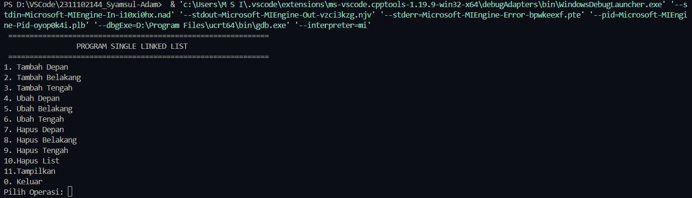
• Tampilan Operasi Tambah:
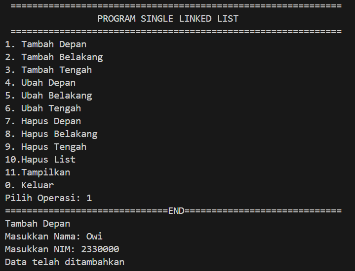
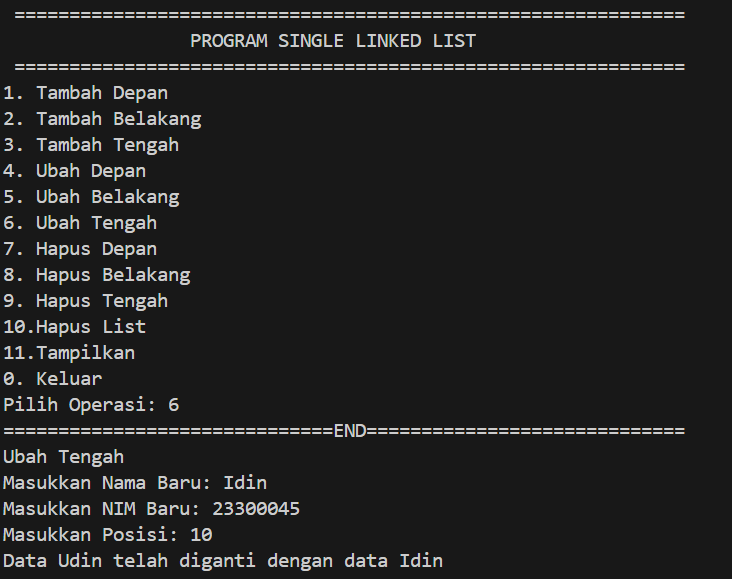
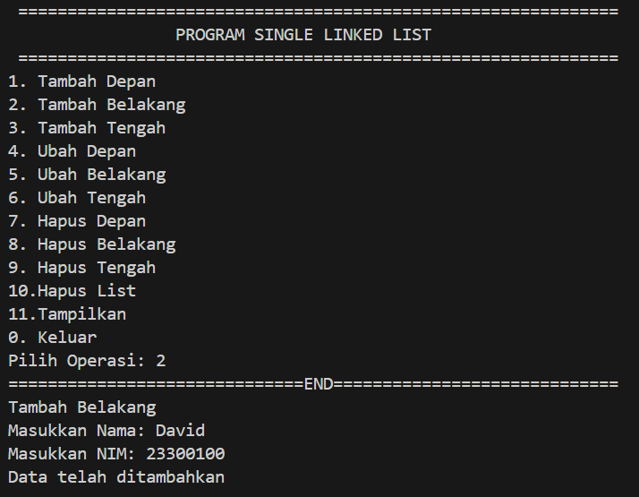
• Tampilan Operasi Hapus:
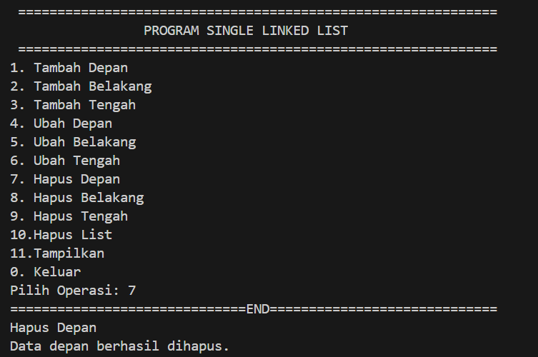
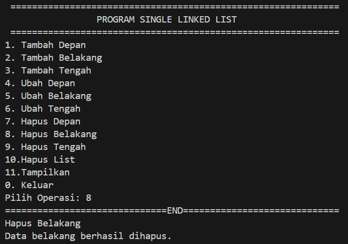

• Tampilan Operasi Ubah:
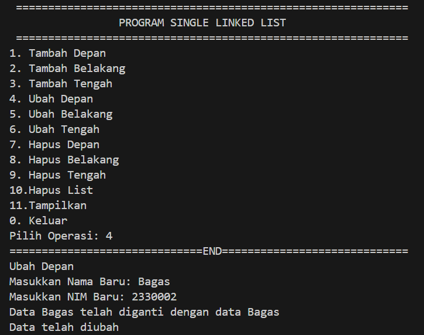
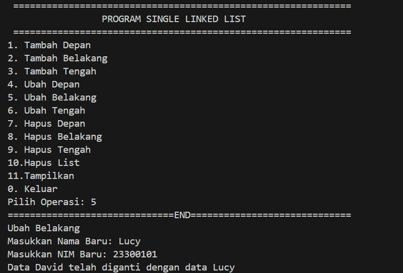

• Tampilan Operasi Tampil Data:
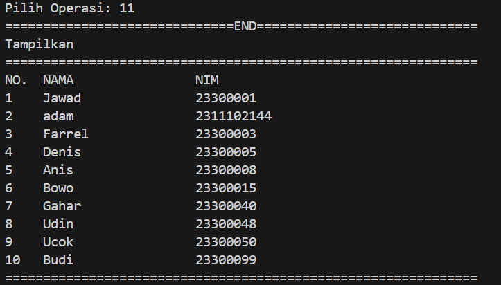

2. Setelah membuat menu tersebut, masukkan data sesuai urutan berikut, lalu
tampilkan data yang telah dimasukkan. (Gunakan insert depan, belakang atau
tengah)
#### Output 2:
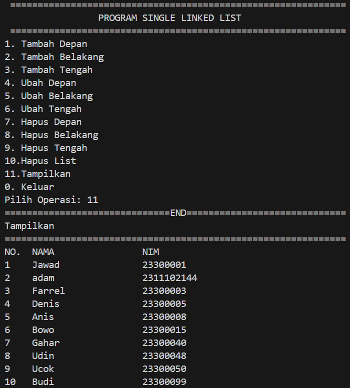

3. Lakukan perintah berikut:


#### Output 3:
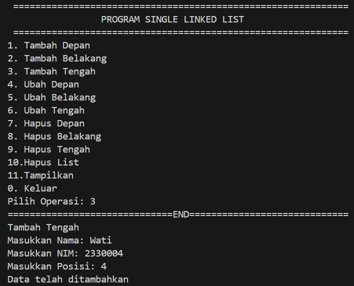


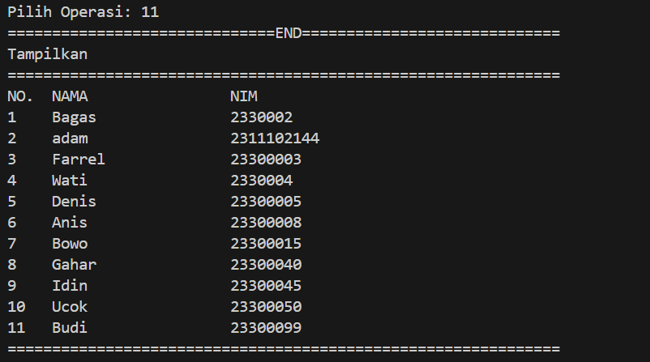


## Kesimpulan
Ini adalah program C++ yang mengimplementasikan struktur data daftar tertaut tunggal. Program ini memiliki LinkedListkelas yang berisi daftar Mahasiswanode (siswa). Setiap Mahasiswanode mempunyai field nama_144dan nim_144, yang masing-masing menyimpan nama dan nomor ID siswa. Kelas LinkedListmemiliki metode berikut:

tambah_depan: menambahkan Mahasiswanode baru ke awal daftar
tambah_belakang: menambahkan Mahasiswanode baru ke akhir daftar
tambah_tengah: menambahkan Mahasiswanode baru ke posisi tertentu dalam daftar
hapus_belakang: menghapus node terakhir Mahasiswadari daftar
hapus_tengah: menghapus Mahasiswanode pada posisi yang ditentukan dari daftar
hapus_list: menghapus semua node dari daftar
ubah_depan: memperbarui nama dan nomor ID node Mahasiswapertama
ubah_belakang: memperbarui nama dan nomor ID node Mahasiswaterakhir
ubah_tengah: memperbarui nama dan nomor ID node Mahasiswapada posisi yang ditentukan
tampilkan: menampilkan nama dan nomor ID semua Mahasiswanode dalam daftar
Fungsi mainprogram ini memungkinkan pengguna untuk menambah dan menghapus Mahasiswanode dari daftar secara interaktif, serta memperbarui nama dan nomor ID mereka. Pengguna juga dapat melihat status daftar saat ini kapan saja. Program terus berjalan hingga pengguna memilih untuk keluar dengan memasukkan 0sesuai pilihannya.
## Referensi
[1] https://www.studocu.com/id/document/institut-teknologi-sepuluh-nopember/algoritma-pemrogaman-komputer-algorithm-and-computer-programming/apa-itu-single-linked-list-non-circular-dan-contoh-program/45206382