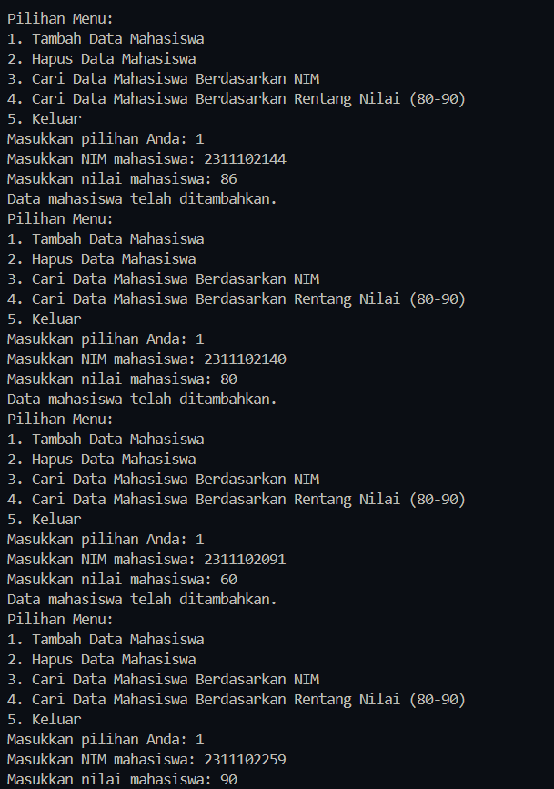
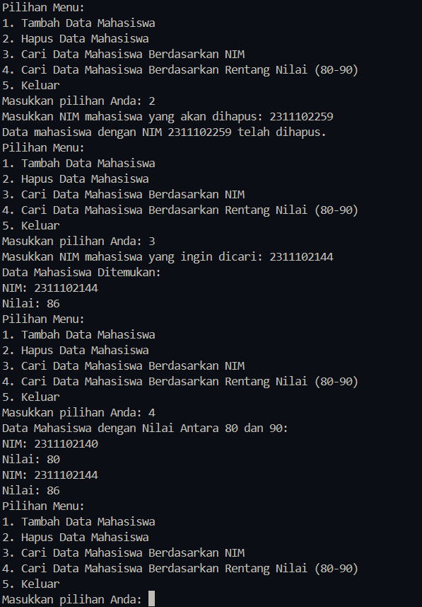

# <h1 align="center">Laporan Praktikum Modul-5 Hash Table</h1>
<p align="center">Syamsul Adam 2311102144</p>

## Dasar Teori

Hash table adalah struktur data yang digunakan untuk mempercepat pencarian data yang berjumlah banyak. Dalam hash table, data disimpan menggunakan key-value yang didapat dari nilai data itu sendiri. Fungsi hash digunakan untuk mendapatkan hash value dari key-value suatu data. Hash table menggunakan memori penyimpanan utama berbentuk array dengan tambahan algoritma untuk mempercepat pemrosesan data. Waktu aksesnya yang cukup cepat, jika record yang dicari langsung berada pada angka hash lokasi penyimpanannya
.
Hash table memiliki beberapa kelebihan, seperti kecepatan dalam insertions, deletions, maupun searching yang relatif sama. Namun, hash table juga memiliki kekurangan, seperti kemungkinan terjadi collision (tabrakan) ketika dua key-value memiliki nilai hash yang sama. Untuk mengatasi collision, beberapa teknik dapat digunakan, seperti Closed Hashing (open addressing) dan Open Hashing (separate chaining). Closed Hashing digunakan untuk menyelesaikan collision dengan cara mencari alamat lain apabila alamat yang dituju sudah terisi oleh data. Ada tiga cara pencarian alamat lain tersebut, yaitu Linear Probing, Quadratic Probing, dan Double Hashing
.
Hash table juga digunakan dalam berbagai aplikasi, seperti pengarsipan dan pencarian data, serta dalam pengembangan algoritma pencarian pola di dalam string. Aplikasi hash table dapat ditemukan dalam berbagai perangkat lunak komputer, terutama untuk larik-larik asosiatif, indeks basis data, caches, dan sets
.
Dalam implementasi hash table, ukuran hash table (H-size) biasanya lebih besar dari jumlah data yang hendak disimpan. Load factor (
𝜆
λ) adalah perbandingan antara data yang disimpan dengan ukuran hash table. Fungsi hash memetakan elemen pada indeks dari hash table. Hashing digunakan untuk melakukan penambahan, penghapusan, dan pencarian dengan constant average time

## Guided 1


```C++
#include <iostream>
using namespace std;

const int MAX_SIZE = 10;

// Fungsi hash sederhana
int hash_func(int key) {
    return key % MAX_SIZE;
}

// Struktur data untuk setiap node
struct Node {
    int key;
    int value;
    Node* next;
    Node(int key, int value) : key(key), value(value), next(nullptr) {}
};

// Class hash table
class HashTable {
private:
    Node** table;

public:
    HashTable() {
        table = new Node*[MAX_SIZE]();
    }

    ~HashTable() {
        for (int i = 0; i < MAX_SIZE; i++) {
            Node* current = table[i];
            while (current != nullptr) {
                Node* temp = current;
                current = current->next;
                delete temp;
            }
        }
        delete[] table;
    }

    // Insertion
    void insert(int key, int value) {
        int index = hash_func(key);
        Node* current = table[index];
        while (current != nullptr) {
            if (current->key == key) {
                current->value = value;
                return;
            }
            current = current->next;
        }
        Node* node = new Node(key, value);
        node->next = table[index];
        table[index] = node;
    }

    // Searching
    int get(int key) {
        int index = hash_func(key);
        Node* current = table[index];
        while (current != nullptr) {
            if (current->key == key) {
                return current->value;
            }
            current = current->next;
        }
        return -1;
    }

    // Deletion
    void remove(int key) {
        int index = hash_func(key);
        Node* current = table[index];
        Node* prev = nullptr;
        while (current != nullptr) {
            if (current->key == key) {
                if (prev == nullptr) {
                    table[index] = current->next;
                } else {
                    prev->next = current->next;
                }
                delete current;
                return;
            }
            prev = current;
            current = current->next;
        }
    }

    // Traversal
    void traverse() {
        for (int i = 0; i < MAX_SIZE; i++) {
            Node* current = table[i];
            while (current != nullptr) {
                cout << current->key << ": " << current->value << endl;
                current = current->next;
            }
        }
    }
};

int main() {
    HashTable ht;

    // Insertion
    ht.insert(1, 10);
    ht.insert(2, 20);
    ht.insert(3, 30);

    // Searching
    cout << "Get key 1: " << ht.get(1) << endl;
    cout << "Get key 4: " << ht.get(4) << endl;
    cout << "Get key 2: " << ht.get(2) << endl;
    cout << "Get key 5: " << ht.get(5) << endl;

    // Deletion
    ht.remove(4);

    // Traversal
    ht.traverse();

    return 0;
}
```
Program ini menggunakan hash table, yang memungkinkan untuk memasukkan, mencari, dan menghapus data. Untuk menentukan indeks penyimpanan, table hash ini menggunakan fungsi hash sederhana yang mengembalikan nilai modulo dari tombol. Struktur data node menyimpan data, yang memiliki tombol, nilai, dan pointer ke node berikutnya. HashTable class memiliki kemampuan untuk memasukkan, mencari, menghapus, dan melintasi data. Sebagai contoh, program membuat hash table dan menggunakan key 1, 2, dan 3. Kemudian, program mencari nilai untuk key 1, 2, dan 5, dan menghapus data dengan key 4. Pada akhirnya, program melakukan traversal untuk menampilkan semua data yang tersimpan dalam hash table.

### Guided 2
```C++
#include <iostream>
#include <string>
#include <vector>
using namespace std;

const int TABLE_SIZE = 11;

class HashNode {
public:
    string name;
    string phone_number;
    HashNode(string name, string phone_number) {
        this->name = name;
        this->phone_number = phone_number;
    }
};

class HashMap {
private:
    vector<HashNode*> table[TABLE_SIZE];

public:
    int hashFunc(string key) {
        int hash_val = 0;
        for (char c : key) {
            hash_val += c;
        }
        return hash_val % TABLE_SIZE;
    }

    void insert(string name, string phone_number) {
        int hash_val = hashFunc(name);
        for (auto node : table[hash_val]) {
            if (node->name == name) {
                node->phone_number = phone_number;
                return;
            }
        }
        table[hash_val].push_back(new HashNode(name, phone_number));
    }

    void remove(string name) {
        int hash_val = hashFunc(name);
        for (auto it = table[hash_val].begin(); it != table[hash_val].end(); it++) {
            if ((*it)->name == name) {
                table[hash_val].erase(it);
                return;
            }
        }
    }

    string searchByName(string name) {
        int hash_val = hashFunc(name);
        for (auto node : table[hash_val]) {
            if (node->name == name) {
                return node->phone_number;
            }
        }
        return "";
    }

    void print() {
        for (int i = 0; i < TABLE_SIZE; i++) {
            cout << i << ": ";
            for (auto pair : table[i]) {
                if(pair != nullptr) {
                    cout << "[" << pair->name << ", " << pair->phone_number << "]";
                }
            }
            cout << endl;
        }
    }
};

int main() {
    HashMap employee_map;
    employee_map.insert("Mistah", "1234");
    employee_map.insert("Pastah", "5678");
    employee_map.insert("Ghana", "91011");

    cout << "Nomer Hp Mistah : " << employee_map.searchByName("Mistah") << endl;
    cout << "Phone Hp Pastah : " << employee_map.searchByName("Pastah") << endl;

    employee_map.remove("Mistah");
    cout << "Nomer Hp Mistah setelah dihapus : " << employee_map.searchByName("Mistah") << endl << endl;

    cout << "Hash Table : " << endl;
    employee_map.print();

    return 0;
}
```
Program ini menggunakan hash table untuk menyimpan data nama dan nomor karyawan. Fungsi hash table menghitung nilai hash dari nama karyawan dan mengembalikan indeks penyimpanan. Struktur data HashNode berisi nama dan nomor telepon untuk menyimpan data. Class HashMap memiliki metode untuk menginsertkan, menghapus, dan mencari data karyawan. Sebuah program membuat hash table dan menginsertkan data karyawan dengan nama "Mistah", "Pastah", dan "Ghana". Kemudian, program mencari nomor telepon karyawan dan menghapus data "Mistah". Pada akhirnya, program menampilkan isi hash table, yang berisi data karyawan yang tersimpan.


## Unguided 

### 1.

```C++
#include <iostream>
#include <vector>
#include <string>
using namespace std;

struct Mahasiswa {
    string NIM_144;
    float NILAI_144;
};

class HashTable {
private:
    static const int table_size = 10; // Ukuran hash table disetel ke 10 untuk contoh
    vector<Mahasiswa> table[table_size];

    int hash_func(string NIM_144) {
        int sum = 0;
        for (char c : NIM_144) {
            sum += int(c);
        }
        return sum % table_size;
    }

public:
    void tambah_data(Mahasiswa mahasiswa) {
        int index = hash_func(mahasiswa.NIM_144);
        table[index].push_back(mahasiswa);
    }

    bool hapus_data(string NIM_144) {
        int index = hash_func(NIM_144);
        for (int i = 0; i < table[index].size(); ++i) {
            if (table[index][i].NIM_144 == NIM_144) {
                table[index].erase(table[index].begin() + i);
                return true;
            }
        }
        return false;
    }

    Mahasiswa* cari_berdasarkan_nim(string NIM_144) {
        int index = hash_func(NIM_144);
        for (Mahasiswa &mahasiswa : table[index]) {
            if (mahasiswa.NIM_144 == NIM_144) {
                return &mahasiswa;
            }
        }
        return nullptr;
    }

    vector<Mahasiswa> cari_berdasarkan_rentang_nilai(float nilai_awal, float nilai_akhir) {
        vector<Mahasiswa> mahasiswa_ditemukan;
        for (int i = 0; i < table_size; ++i) {
            for (Mahasiswa &mahasiswa : table[i]) {
                if (mahasiswa.NILAI_144 >= nilai_awal && mahasiswa.NILAI_144 <= nilai_akhir) {
                    mahasiswa_ditemukan.push_back(mahasiswa);
                }
            }
        }
        return mahasiswa_ditemukan;
    }
};

// Fungsi untuk menampilkan menu
void tampilkan_menu() {
    cout << "Pilihan Menu:" << endl;
    cout << "1. Tambah Data Mahasiswa" << endl;
    cout << "2. Hapus Data Mahasiswa" << endl;
    cout << "3. Cari Data Mahasiswa Berdasarkan NIM" << endl;
    cout << "4. Cari Data Mahasiswa Berdasarkan Rentang Nilai (80-90)" << endl;
    cout << "5. Keluar" << endl;
}

int main() {
    HashTable hash_table;

    while (true) {
        tampilkan_menu();
        int pilihan;
        cout << "Masukkan pilihan Anda: ";
        cin >> pilihan;

        if (pilihan == 1) {
            Mahasiswa mahasiswa;
            cout << "Masukkan NIM mahasiswa: ";
            cin >> mahasiswa.NIM_144;
            cout << "Masukkan nilai mahasiswa: ";
            cin >> mahasiswa.NILAI_144;
            hash_table.tambah_data(mahasiswa);
            cout << "Data mahasiswa telah ditambahkan." << endl;
        } else if (pilihan == 2) {
            string NIM_144;
            cout << "Masukkan NIM mahasiswa yang akan dihapus: ";
            cin >> NIM_144;
            if (hash_table.hapus_data(NIM_144)) {
                cout << "Data mahasiswa dengan NIM " << NIM_144 << " telah dihapus." << endl;
            } else {
                cout << "Data mahasiswa dengan NIM " << NIM_144 << " tidak ditemukan." << endl;
            }
        } else if (pilihan == 3) {
            string NIM_144;
            cout << "Masukkan NIM mahasiswa yang ingin dicari: ";
            cin >> NIM_144;
            Mahasiswa* mahasiswa = hash_table.cari_berdasarkan_nim(NIM_144);
            if (mahasiswa != nullptr) {
                cout << "Data Mahasiswa Ditemukan:" << endl;
                cout << "NIM: " << mahasiswa->NIM_144 << endl;
                cout << "Nilai: " << mahasiswa->NILAI_144 << endl;
            } else {
                cout << "Data Mahasiswa dengan NIM " << NIM_144 << " tidak ditemukan." << endl;
            }
        } else if (pilihan == 4) {
            vector<Mahasiswa> mahasiswa_ditemukan = hash_table.cari_berdasarkan_rentang_nilai(80, 90);
            if (!mahasiswa_ditemukan.empty()) {
                cout << "Data Mahasiswa dengan Nilai Antara 80 dan 90:" << endl;
                for (Mahasiswa &mahasiswa : mahasiswa_ditemukan) {
                    cout << "NIM: " << mahasiswa.NIM_144 << endl;
                    cout << "Nilai: " << mahasiswa.NILAI_144 << endl;
                }
            } else {
                cout << "Tidak Ada Data Mahasiswa dengan Nilai Antara 80 dan 90." << endl;
            }
        } else if (pilihan == 5) {
            cout << "Terima Kasih!" << endl;
            break;
        } else {
            cout << "Pilihan Tidak Valid. Silakan Pilih Lagi." << endl;
        }
    }

    return 0;
}


//Program ini menggunakan hash table untuk mengelola data siswa dengan NIM dan nilai. Hash table ini menggunakan fungsi hash untuk menghitung nilai hash NIM dan mengembalikan indeks penyimpanan. Data disimpan dalam struktur data siswa, yang memiliki NIM dan nilai. HashTable Class memiliki metode untuk menginsertkan, menghapus, dan mencari data siswa. Dalam program tertentu, hash table dibuat dan digunakan untuk menginsertkan, menghapus, mencari data siswa berdasarkan NIM, dan mencari data siswa berdasarkan rentang nilai. Selain itu, program menampilkan menu di mana pengguna dapat memilih operasi apa yang harus dilakukan.
```
#### Output:




## Kesimpulan
Program ini menggunakan hash table untuk mengelola data siswa dengan NIM dan nilai. Hash table ini menggunakan fungsi hash untuk menghitung nilai hash NIM dan mengembalikan indeks penyimpanan. Program ini memiliki metode untuk menginsertkan, menghapus, dan mencari data siswa berdasarkan NIM. Selain itu, program ini juga dapat mencari data siswa berdasarkan rentang nilai dan menampilkan menu untuk memilih operasi yang harus dilakukan.

## Referensi
[1] https://hyperskill.org/learn/step/13054