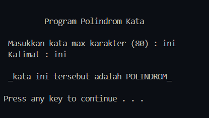
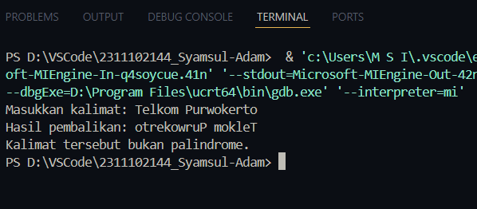

# <h1 align="center">Laporan Praktikum Modul-6 STACK</h1>
<p align="center">Syamsul Adam 2311102144</p>

## Dasar Teori

Dasar teori stack adalah prinsip operasi Last In First Out (LIFO), yang berarti elemen yang terakhir disisipkan akan menjadi elemen pertama yang keluar. Stack digunakan untuk menyimpan data dalam suatu struktur yang linier, dengan operasi-operasi dasar seperti push untuk menambahkan elemen ke bagian atas stack, pop untuk menghapus elemen atas dari stack, dan peek untuk mendapatkan nilai elemen teratas tanpa menghapusnya. Stack juga memiliki beberapa karakteristik, seperti ukuran memori terbatas yang dapat menyebabkan error jika stack penuh (stack overflow) atau kosong (stack underflow). Stack digunakan dalam berbagai algoritma dan aplikasi, seperti Tower of Hanoi, Tree traversal, rekursi, dan lain-lain.

## Guided 1


```C++
#include <iostream>
using namespace std;

string arrayBuku[5];
int maksimal = 5, top = 0;

bool isFull() {
    return (top == maksimal);
}

bool isEmpty() {
    return (top == 0);
}

void pushArrayBuku(string data) {
    if (isFull()) {
        cout << "Data telah penuh" << endl;
    } else {
        arrayBuku[top] = data;
        top++;
    }
}

void popArrayBuku() {
    if (isEmpty()) {
        cout << "Tidak ada data yang dihapus" << endl;
    } else {
        arrayBuku[top - 1] = "";
        top--;
    }
}

void peekArrayBuku(int posisi) {
    if (isEmpty()) {
        cout << "Tidak ada data yang bisa dilihat" << endl;
    } else {
        int index = top;
        for (int i = 1; i <= posisi; i++) {
            index--;
        }
        cout << "Posisi ke " << posisi << " adalah " << arrayBuku[index] << endl;
    }
}

int countStack() {
    return top;
}

void changeArrayBuku(int posisi, string data) {
    if (posisi > top) {
        cout << "Posisi melebihi data yang ada" << endl;
    } else {
        int index = top;
        for (int i = 1; i <= posisi; i++) {
            index--;
        }
        arrayBuku[index] = data;
    }
}

void destroyArraybuku() {
    for (int i = top; i >= 0; i--) {
        arrayBuku[i] = "";
    }
    top = 0;
}

void cetakArrayBuku() {
    if (isEmpty()) {
        cout << "Tidak ada data yang dicetak" << endl;
    } else {
        for (int i = top - 1; i >= 0; i--) {
            cout << arrayBuku[i] << endl;
        }
    }
}

int main() {
    pushArrayBuku("Kalkulus");
    pushArrayBuku("Struktur Data");
    pushArrayBuku("Matematika Diskrit");
    pushArrayBuku("Dasar Multimedia");
    pushArrayBuku("Inggris");

    cetakArrayBuku();
    cout << "\n";

    cout << "Apakah data stack penuh? " << isFull() << endl;
    cout << "Apakah data stack kosong? " << isEmpty() << endl;

    peekArrayBuku(2);
    popArrayBuku();
    cout << "Banyaknya data = " << countStack() << endl;

    changeArrayBuku(2, "Bahasa Jerman");
    cetakArrayBuku();
    cout << "\n";

    destroyArraybuku();

    cout << "Jumlah data setelah dihapus: " << top << endl;
    cetakArrayBuku();

    return 0;
}
```
Program ini adalah implementasi stack menggunakan array untuk menyimpan data buku. Stack ini memiliki operasi-operasi dasar seperti push untuk menambahkan data, pop untuk menghapus data, peek untuk melihat data pada posisi tertentu, dan count untuk menghitung jumlah data. Program ini juga memiliki fungsi untuk mengubah data pada posisi tertentu dan menghapus semua data.


## Unguided 1


```C++
#include <iostream>
#include <conio.h>
#include <string.h>
#include <stdio.h>
#include <stdlib.h>
#define maxstack196 200
using namespace std;

struct STACK {
    int top;
    char data[maxstack196];
};

char data[maxstack196];
struct STACK stacknew;

void inisialisasi() {
    stacknew.top = -1;
}

bool isFull() {
    if (stacknew.top == maxstack196 - 1) {
        return true;
    } else {
        return false;
    }
}

bool isEmpty() {
    if (stacknew.top == -1) {
        return true;
    } else {
        return false;
    }
}

void push(char data) {
    if (isFull() == false) {
        stacknew.top++;
        stacknew.data[stacknew.top] = data;
    } else {
        cout << "\n _stack penuh_";
    }
}

void pop() {
    while (isEmpty() == false) {
        cout << stacknew.data[stacknew.top];
        stacknew.top--;
    }
}

void print() {
    cout << "";
    for (int r = 0; r <= stacknew.top; r++) {
        cout << stacknew.data[r];
    }
}

void clear() {
    stacknew.top = -1;
}

int main() {
    while (true) {
        system("cls");
        char kata[80];
        cout << "\n \t Program Polindrom Kata \t" << endl;
        cout << endl;
        int i, j, flag = 0, panjang, cek = 0;
        cout << " Masukkan kata max karakter (80) : ";
        cin.getline(kata, 80);
        panjang = strlen(kata);
        for (i = 0, j = panjang - 1; i <= (panjang / 2); ++i, --j) {
            if (tolower(kata[i]) == tolower(kata[j])) {
                flag++;
            } else {
                flag = 0;
            }
            cek++;
        }
        if (flag == cek) {
            cout << " Kalimat : " << kata << "\n\n _kata " << kata << " tersebut adalah POLINDROM_ \n" << endl;
        } else {
            cout << " Kalimat : " << kata << "\n\n _kata " << kata << " tersebut BUKAN polindrom_ \n" << endl;
            getch();
        }
        system("pause");
    }
    return 0;
}
```
Program ini adalah aplikasi untuk memeriksa apakah suatu kalimat adalah polindrom atau tidak. Polindrom adalah kalimat yang memiliki sifat bahwa kalimat tersebut sama ketika dibaca dari awal hingga akhir dan juga ketika dibaca dari akhir hingga awal. Program ini menggunakan stack untuk memeriksa kalimat dan menampilkan hasilnya.

#### Output:



## Unguided 2


```C++
#include <iostream>
#include <stack>
#include <string>
using namespace std;

// Fungsi untuk membalikkan kalimat menggunakan stack
string reverseSentence(string sentence) {
    stack<char> charStack;
    string reversedSentence = "";
    // Push setiap karakter ke dalam stack
    for (char c : sentence) {
        charStack.push(c);
    }
    // Pop setiap karakter dari stack untuk mendapatkan kalimat terbalik
    while (!charStack.empty()) {
        reversedSentence += charStack.top();
        charStack.pop();
    }
    return reversedSentence;
}

int main() {
    string kalimat;
    cout << "Masukkan kalimat: ";
    getline(cin, kalimat);
    
    string hasilPembalikan = reverseSentence(kalimat);
    cout << "Hasil pembalikan: " << hasilPembalikan << endl;
    
    if (kalimat == hasilPembalikan) {
        cout << "Kalimat tersebut adalah palindrome." << endl;
    } else {
        cout << "Kalimat tersebut bukan palindrome." << endl;
    }
    
    return 0;
}

```
#### Output:



Program ini adalah aplikasi untuk memeriksa apakah suatu kalimat adalah palindrome atau tidak. Palindrome adalah kalimat yang memiliki sifat bahwa kalimat tersebut sama ketika dibaca dari awal hingga akhir dan juga ketika dibaca dari akhir hingga awal. Program ini menggunakan stack untuk menuangkan kalimat dan kemudian membandingkan kalimat asli dengan kalimat terbalik untuk menentukan apakah kalimat tersebut palindrome atau tidak.


## Kesimpulan
Program ini adalah implementasi stack yang digunakan untuk berbagai aplikasi, termasuk:
menyimpan data buku dengan operasi-operasi dasar seperti push, pop, peek, dan count.
Memeriksa apakah suatu kalimat adalah polindrom atau tidak dengan menggunakan stack untuk memaksimalkan kalimat dan membandingkan dengan kalimat asli.
Memeriksa apakah suatu kalimat adalah palindrome atau tidak dengan menggunakan stack untuk menuangkan kalimat dan membandingkan dengan kalimat terbalik.
Secara keseluruhan, program ini menunjukkan bagaimana stack dapat digunakan dalam berbagai aplikasi yang berbeda dan memiliki kegunaan yang luas dalam berbagai bidang.

## Referensi
[\[1\] https://hyperskill.org/learn/step/13054](https://www.academia.edu/32592016/LAPORAN_PRAKTIKUM_4_ALGORITMA_STRUKTUR_DATA_STACK)