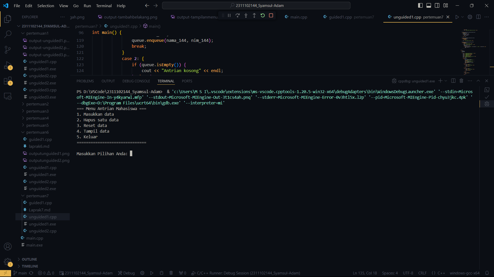

# <h1 align="center">Laporan Praktikum Modul-7 QUEUE</h1>
<p align="center">Syamsul Adam 2311102144</p>

## Dasar Teori

Queue atau antrian dalam struktur data adalah kumpulan data yang memungkinkan penambahan elemen hanya di satu ujung yang disebut sisi belakang (rear) dan penghapusan elemen dari ujung lainnya. Prinsip kerja queue adalah "First In First Out" (FIFO) atau "masuk pertama keluar pertama," berbeda dengan "Last In First Out" (LIFO) yang digunakan pada stack atau tumpukan.

Dalam antrian, ada satu pintu masuk di satu ujung dan satu pintu keluar di ujung lainnya. Oleh karena itu, terdapat penunjuk yang menunjukkan awal dan akhir antrian. Operasi-operasi penting dalam antrian meliputi:

1. **Add**: Menambah elemen ke dalam antrian.
2. **Delete**: Menghapus atau mengeluarkan elemen dari antrian.

Dalam ilmu komputer, antrian sering digunakan dalam sistem operasi yang memerlukan manajemen sumber daya dan penjadwalan, seperti pada sistem komputer time-sharing yang digunakan oleh banyak orang secara bersamaan.

Terdapat operasi bernama **add_priority** dalam antrian, yang mengubah antrian menjadi berdasarkan prioritas tertentu. Dengan demikian, elemen baru yang ditambahkan tidak selalu berada di akhir.

Operasi-operasi dalam Queue:

1. **Create**: Membuat dan menginisialisasi antrian dengan membuat Head dan Tail = -1.
2. **IsEmpty**: Memeriksa apakah antrian kosong dengan mengecek nilai tail. Jika tail = -1, maka antrian kosong. Head tidak diperiksa karena menunjukkan elemen pertama dalam antrian yang tidak berubah. Pergerakan terjadi dengan penambahan elemen di bagian belakang menggunakan nilai tail.
3. **IsFull**: Mengecek apakah antrian penuh dengan melihat nilai tail. Jika tail >= MAX-1, maka antrian penuh.
4. **EnQueue**: Menambahkan elemen ke dalam antrian di bagian paling belakang dengan mengincrement nilai tail terlebih dahulu.
5. **DeQueue**: Menghapus elemen terdepan (head) dengan menggeser semua elemen ke depan dan mengurangi tail dengan 1, dilakukan dengan pengulangan.
6. **Clear**: Menghapus elemen-elemen antrian dengan menyetel nilai tail dan head menjadi -1, sehingga elemen-elemen tidak lagi terbaca meskipun arraynya tidak terhapus.
7. **Tampil**: Menampilkan nilai-nilai elemen antrian dengan pengulangan dari head hingga tail.

## Guided 1

```C++
#include <iostream>
using namespace std;

//mengecek antrian apakah sudah penuh
const int maksimalAntrian = 5;
int front = 0;
int back = 0;
string queueTeller[5];

bool isFull(){
    if (back == maksimalAntrian){
        return true;
    } else {
        return false;
    }
}

//mengecek antrian apakah masih kosong
bool isEmpty(){
    if(back == 0){
        return true;
    } else {
        return false;
    }
}

//menambah antrian
void tambahData(string nama){
    if (isFull ()){
        cout<<"Antrian sudah penuh."<<endl;
    } else {
        if (isEmpty ()){
            queueTeller[0] = nama;
            front++;
            back++;
        } else{
            queueTeller[back] = nama;
            back++;
        }
    }
}

//mengurangi antrian
void kurangAntrian (){
    if (isEmpty ()){
        cout<<"Antrian kosong."<<endl;
    } else {
        for (int i = 0; i < back; i++)
        {
            queueTeller[i] = queueTeller[i + 1];
        }
        back --;
    }
}

//menghitung banyak antrian
int count () {
    return back;
}

//menghapus seluruh antrian
void clearQueue (){
    if (isEmpty ()){
        cout<<"Antrian kosong"<<endl;
    } else {
        for (int i = 0; i < back; i++){
            queueTeller[i] = "";
        }
        back = 0;
        front = 0;
    }
}

//melihat antrian
void viewQueue (){
    cout<<"Data antrian: "<<endl;
    for (int i = 0; i < maksimalAntrian; i++){
        if (queueTeller[i] !=""){
            cout<<i+1<<"."<<queueTeller[i]<<endl;
        }else {
            cout<<i+1<<"."<<"(kosong)"<<endl;
        }
    }
}

//main fungsi
int main (){
    tambahData("Alya");
    tambahData("Kiki");
    tambahData("Artika");
    viewQueue();

    //mengurangi antrian
    kurangAntrian();
    viewQueue();

    //menghapus seluruh antrian
    clearQueue();
    viewQueue();
}
```
Script di atas adalah implementasi antrian (queue) menggunakan array di C++. Skrip ini memungkinkan pengguna untuk menambah (enqueue) dan menghapus (dequeue) elemen dari antrian, memeriksa apakah antrian penuh atau kosong, menghitung jumlah elemen dalam antrian, menghapus seluruh elemen antrian, dan menampilkan elemen yang ada dalam antrian. Antrian diatur menggunakan dua variabel penunjuk, `front` dan `back`, untuk menandai awal dan akhir antrian. Fungsi `isFull` dan `isEmpty` digunakan untuk memeriksa kondisi antrian, sementara `tambahData` dan `kurangAntrian` masing-masing digunakan untuk menambah dan menghapus elemen dari antrian. Fungsi `clearQueue` mengosongkan seluruh elemen dalam antrian, dan `viewQueue` menampilkan isi antrian. Pada fungsi `main`, beberapa operasi dasar antrian seperti penambahan, penghapusan, dan pengosongan antrian dijalankan dan hasilnya ditampilkan.


## Unguided 1


```C++
#include <iostream>
using namespace std;

// Struktur simpul untuk node dalam linked list
struct Mahasiswa {
    string nama144;
    string nim144;
    Mahasiswa* next;
};

// Kelas Queue yang menggunakan linked list
class Queue {
private:
    Mahasiswa* front; // Pointer ke depan antrian
    Mahasiswa* back;  // Pointer ke belakang antrian

public:
    Queue() {
        front = nullptr;
        back = nullptr;
    }

    // Fungsi untuk mengecek apakah antrian kosong
    bool isEmpty() {
        return front == nullptr;
    }

    // Fungsi untuk menambahkan data ke antrian
    void enqueue(string nama_adm, string nim_adm) {
        Mahasiswa* newNode = new Mahasiswa();
        newNode->nama144 = nama_adm;
        newNode->nim144 = nim_adm;
        newNode->next = nullptr;

        // Jika antrian kosong, node baru menjadi front dan back
        if (isEmpty()) {
            front = newNode;
            back = newNode;
        } else {
            // Jika antrian tidak kosong, tambahkan node baru ke belakang dan update back
            back->next = newNode;
            back = newNode;
        }
        cout << "Data berhasil dimasukkan ke dalam antrian" << endl;
    }

    // Fungsi untuk menghapus data dari antrian
    void dequeue() {
        if (isEmpty()) {
            cout << "Antrian kosong" << endl;
        } else {
            // Jika antrian tidak kosong, hapus node pertama dan update front
            Mahasiswa* temp = front;
            front = front->next;
            delete temp;
            cout << "Data berhasil dihapus dari antrian" << endl;
        }
    }

    // Fungsi untuk menghitung jumlah data dalam antrian
    int countQueue() {
        int count = 0;
        Mahasiswa* temp = front;
        while (temp != nullptr) {
            count++;
            temp = temp->next;
        }
        return count;
    }

    // Fungsi untuk menghapus semua data dari antrian
    void clearQueue() {
        while (!isEmpty()) {
            dequeue();
        }
        cout << "Data berhasil di-reset" << endl;
    }

    // Fungsi untuk menampilkan data dalam antrian
    void viewQueue() {
        if (isEmpty()) {
            cout << "Antrian kosong" << endl;
        } else {
            cout << "Data antrian Mahasiswa: " << endl;
            Mahasiswa* temp = front;
            int pos = 1;
            while (temp != nullptr) {
                cout << pos << ". Nama: " << temp->nama144 << " || NIM: " << temp->nim144 << endl;
                temp = temp->next;
                pos++;
            }
        }
    }
};

int main() {
    Queue queue;
    int choice;

    do {
        cout << "=== Menu Antrian Mahasiswa ===" << endl;
        cout << "1. Masukkan data" << endl;
        cout << "2. Hapus satu data" << endl;
        cout << "3. Reset data" << endl;
        cout << "4. Tampil data" << endl;
        cout << "5. Keluar" << endl;
        cout << "==============================\n" << endl;
        cout << "Masukkan Pilihan Anda: ";
        cin >> choice;

        switch (choice) {
            case 1: {
                string nama_144, nim_144;
                cout << "Masukkan Nama Mahasiswa : ";
                cin.ignore();
                getline(cin, nama_144);
                cout << "Masukkan NIM Mahasiswa  : ";
                cin >> nim_144;
                queue.enqueue(nama_144, nim_144);
                break;
            }
            case 2: {
                if (queue.isEmpty()) {
                    cout << "Antrian kosong" << endl;
                } else {
                    queue.dequeue ();
                }
                break;
            }
            case 3: {
                if (queue.isEmpty()) {
                    cout << "Antrian kosong" << endl;
                } else {
                    queue.clearQueue();
                }
                break;
            }
            case 4: {
                queue.viewQueue();
                break;
            }
            case 5: {
                cout << "Terima kasih telah menggunakan layanan kami ;)" << endl;
                break;
            }
            default: {
                cout << "Pilihan yang Anda masukkan tidak valid" << endl;
                break;
            }
        }

        cout << endl;

    } while (choice != 5);

    return 0;
}
```
Script di atas adalah implementasi dari antrian (queue) menggunakan linked list dalam bahasa C++. Struktur data ini terdiri dari simpul (node) yang diwakili oleh struktur Mahasiswa, yang memiliki dua anggota data (nama144 dan nim144) serta satu pointer next untuk menunjuk ke simpul berikutnya dalam antrian. Kelas Queue memanfaatkan linked list ini untuk mengelola antrian dengan beberapa operasi dasar:

isEmpty: Mengecek apakah antrian kosong dengan memeriksa apakah pointer front adalah nullptr.
enqueue: Menambahkan simpul baru ke belakang antrian. Jika antrian kosong, simpul baru menjadi front dan back. Jika tidak, simpul baru ditambahkan ke belakang dan pointer back diperbarui.
dequeue: Menghapus simpul dari depan antrian. Jika antrian tidak kosong, simpul depan dihapus dan pointer front diperbarui ke simpul berikutnya.
countQueue: Menghitung jumlah simpul dalam antrian dengan iterasi dari front ke back.
clearQueue: Menghapus semua simpul dalam antrian dengan melakukan dequeue berulang kali sampai antrian kosong.
viewQueue: Menampilkan semua data dalam antrian dengan iterasi dari front ke back, menampilkan nama dan NIM dari setiap simpul.

#### Output:



## Unguided 2


```C++
#include <iostream>
using namespace std;

// Struktur simpul untuk node dalam linked list
struct Mahasiswa {
    string nama144;
    string nim144;
    Mahasiswa* next;
};

// Kelas Queue yang menggunakan linked list
class Queue {
private:
    Mahasiswa* front; // Pointer ke depan antrian
    Mahasiswa* back;  // Pointer ke belakang antrian

public:
    Queue() {
        front = nullptr;
        back = nullptr;
    }

    // Fungsi untuk mengecek apakah antrian kosong
    bool isEmpty() {
        return front == nullptr;
    }

    // Fungsi untuk menambahkan data ke antrian
    void enqueue(string nama_adm, string nim_adm) {
        Mahasiswa* newNode = new Mahasiswa();
        newNode->nama144 = nama_adm;
        newNode->nim144 = nim_adm;
        newNode->next = nullptr;

        // Jika antrian kosong, node baru menjadi front dan back
        if (isEmpty()) {
            front = newNode;
            back = newNode;
        } else {
            // Jika antrian tidak kosong, tambahkan node baru ke belakang dan update back
            back->next = newNode;
            back = newNode;
        }
        cout << "Data berhasil dimasukkan ke dalam antrian" << endl;
    }

    // Fungsi untuk menghapus data dari antrian
    void dequeue() {
        if (isEmpty()) {
            cout << "Antrian kosong" << endl;
        } else {
            // Jika antrian tidak kosong, hapus node pertama dan update front
            Mahasiswa* temp = front;
            front = front->next;
            delete temp;
            cout << "Data berhasil dihapus dari antrian" << endl;
        }
    }

    // Fungsi untuk menghitung jumlah data dalam antrian
    int countQueue() {
        int count = 0;
        Mahasiswa* temp = front;
        while (temp != nullptr) {
            count++;
            temp = temp->next;
        }
        return count;
    }

    // Fungsi untuk menghapus semua data dari antrian
    void clearQueue() {
        while (!isEmpty()) {
            dequeue();
        }
        cout << "Data berhasil di-reset" << endl;
    }

    // Fungsi untuk menampilkan data dalam antrian
    void viewQueue() {
        if (isEmpty()) {
            cout << "Antrian kosong" << endl;
        } else {
            cout << "Data antrian Mahasiswa: " << endl;
            Mahasiswa* temp = front;
            int pos = 1;
            while (temp != nullptr) {
                cout << pos << ". Nama: " << temp->nama144 << " || NIM: " << temp->nim144 << endl;
                temp = temp->next;
                pos++;
            }
        }
    }
};

int main() {
    Queue queue;
    int choice;

    do {
        cout << "=== Menu Antrian Mahasiswa ===" << endl;
        cout << "1. Masukkan data" << endl;
        cout << "2. Hapus satu data" << endl;
        cout << "3. Reset data" << endl;
        cout << "4. Tampil data" << endl;
        cout << "5. Keluar" << endl;
        cout << "==============================\n" << endl;
        cout << "Masukkan Pilihan Anda: ";
        cin >> choice;

        switch (choice) {
            case 1: {
                string nama_144, nim_144;
                cout << "Masukkan Nama Mahasiswa : ";
                cin.ignore();
                getline(cin, nama_144);
                cout << "Masukkan NIM Mahasiswa  : ";
                cin >> nim_144;
                queue.enqueue(nama_144, nim_144);
                break;
            }
            case 2: {
                if (queue.isEmpty()) {
                    cout << "Antrian kosong" << endl;
                } else {
                    queue.dequeue ();
                }
                break;
            }
            case 3: {
                if (queue.isEmpty()) {
                    cout << "Antrian kosong" << endl;
                } else {
                    queue.clearQueue();
                }
                break;
            }
            case 4: {
                queue.viewQueue();
                break;
            }
            case 5: {
                cout << "Terima kasih telah menggunakan layanan kami ;)" << endl;
                break;
            }
            default: {
                cout << "Pilihan yang Anda masukkan tidak valid" << endl;
                break;
            }
        }

        cout << endl;

    } while (choice != 5);

    return 0;
}

```
#### Output:
.png)
.png)


Script di atas adalah implementasi antrian (queue) menggunakan linked list dalam bahasa C++. Struktur Mahasiswa merepresentasikan setiap simpul dalam linked list, dengan dua atribut data (nama144 dan nim144) serta pointer next yang menunjuk ke simpul berikutnya. Kelas Queue memiliki dua pointer, front dan back, untuk menandai awal dan akhir antrian, serta berbagai metode untuk mengelola antrian:

isEmpty: Memeriksa apakah antrian kosong.
enqueue: Menambahkan simpul baru ke belakang antrian.
dequeue: Menghapus simpul dari depan antrian.
countQueue: Menghitung jumlah simpul dalam antrian.
clearQueue: Menghapus semua simpul dalam antrian.
viewQueue: Menampilkan semua data dalam antrian.

Fungsi utama (main) menyediakan antarmuka pengguna berbasis teks dengan menu untuk menambah data, menghapus satu data, mereset data, menampilkan data, dan keluar dari program. Pengguna dapat memilih operasi yang ingin dilakukan melalui input numerik, dan setiap pilihan akan memanggil metode yang sesuai dari objek Queue. Program akan terus berjalan hingga pengguna memilih untuk keluar dengan memasukkan pilihan 5.


## Kesimpulan
Setelah mempelajari materi tentang Queue dan penerapannya menggunakan Linked List dan Array, kita memahami bahwa Queue adalah struktur data yang mengikuti prinsip FIFO (First-In-First-Out), yang berarti elemen yang pertama kali masuk akan menjadi yang pertama keluar. Queue dapat diimplementasikan baik dengan Linked List maupun Array. Linked List menawarkan fleksibilitas dalam menambah dan menghapus elemen, sedangkan Array memungkinkan akses langsung ke elemen-elemen dalam antrian. Implementasi Queue menggunakan Linked List membutuhkan alokasi memori dinamis untuk setiap elemen yang ditambahkan atau dihapus, sehingga memungkinkan antrian bertambah atau berkurang sesuai kebutuhan. Sebaliknya, implementasi Queue menggunakan Array memiliki batasan ukuran tetap, sehingga kapasitas antrian sudah ditentukan sebelumnya. Jika antrian penuh, elemen baru tidak bisa ditambahkan.

Operasi dasar pada Queue mencakup enqueue (menambahkan elemen ke dalam antrian), dequeue (menghapus elemen dari antrian), isEmpty (memeriksa apakah antrian kosong), countQueue (menghitung jumlah elemen dalam antrian), dan viewQueue (menampilkan elemen-elemen dalam antrian). Queue sangat berguna dalam situasi yang membutuhkan pemrosesan data secara berurutan sesuai urutan kedatangan, seperti simulasi antrian pelanggan atau penjadwalan tugas. Pemilihan antara implementasi Queue dengan Linked List atau Array bergantung pada kebutuhan dan karakteristik spesifik masalah yang dihadapi. Linked List lebih fleksibel dalam hal ukuran yang bisa berubah, sementara Array lebih efisien dalam hal akses elemen.

Dengan memahami konsep dasar Queue serta penerapannya menggunakan Linked List dan Array, kita dapat menggunakannya untuk menyelesaikan berbagai masalah yang melibatkan pengolahan data berdasarkan urutan kedatangan.

## Referensi
[1]  M. Alizadeh, S. Yang, M. Sharif, S. Katti, N. McKeown, B. Prabhakar, and S. Shenker. pFabric: Minimal Near-optimal Datacenter Transport. In SIGCOMM, 2013.