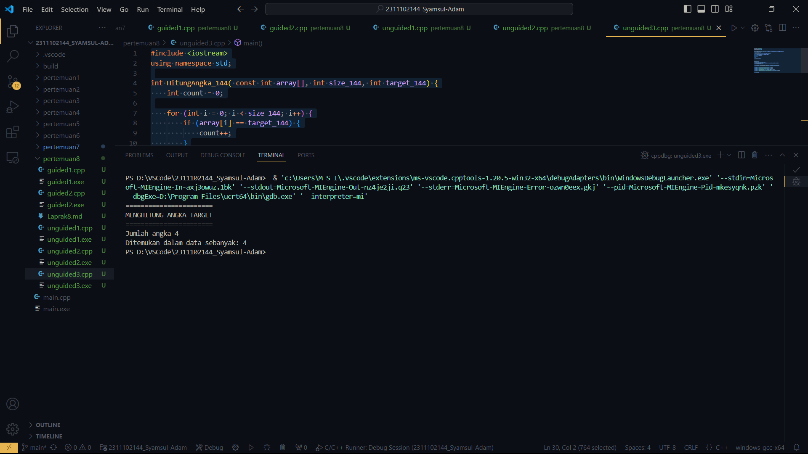

# <h1 align="center">Laporan Praktikum Modul 8 Algoritma Searching</h1>
<p align="center">Syamsul Adam - 2311102144</p>

## Dasar Teori

Dalam pengembangan program, dua algoritma pencarian yang umum digunakan adalah Sequential Search dan Binary Search. Masing-masing memiliki cara yang berbeda dalam mencari data yang dicari.

Sequential Search membandingkan setiap elemen array secara berurutan, mulai dari elemen pertama, hingga elemen yang dicari ditemukan atau semua elemen diperiksa. Jika elemen ditemukan, ia mengembalikan indeksnya, jika tidak, maka output adalah -1. Contoh dari algoritma ini adalah Linear Search.

Sementara itu, Binary Search hanya dapat digunakan pada data yang sudah terurut. Algoritma ini membagi data menjadi dua bagian setiap kali dan memeriksa apakah elemen yang dicari berada di setengah kiri atau setengah kanan. Jika ditemukan kecocokan nilai, maka akan mengembalikan output, jika tidak, pencarian akan terus berlanjut hingga akhir dari pembagian jumlah elemen tersebut. Contoh dari algoritma ini adalah Binary Search.

Dalam memilih antara Sequential Search dan Binary Search, beberapa hal perlu dipertimbangkan. Jika data tidak terurut atau jumlah data yang dicari relatif kecil, maka Sequential Search lebih sesuai. Namun, jika data sudah terurut dan jumlah data yang dicari relatif besar, maka Binary Search lebih efisien karena hanya memerlukan logaritma basis 2 dari jumlah data yang dicari, sedangkan Sequential Search memerlukan waktu yang lebih lama karena harus memeriksa setiap elemen secara berurutan.

Perbedaan antara Sequential Search dan Binary Search adalah bahwa Sequential Search membandingkan setiap elemen secara berurutan, sedangkan Binary Search membagi data menjadi dua bagian dan memeriksa apakah elemen yang dicari berada di setengah kiri atau setengah kanan. Selain itu, Binary Search hanya dapat digunakan pada data yang sudah terurut, sedangkan Sequential Search dapat digunakan pada data yang tidak terurut. Namun, Binary Search lebih efisien dan lebih rumit daripada Sequential Search.


## Guided 

### 1. [Guided 1]

```C++
#include <iostream>
using namespace std;

int main() {
    int n = 10;
    int data[n] = {9, 4, 1, 7, 5, 12, 4, 13, 4, 10};
    int cari = 10;
    bool ketemu = false;
    int i;
    // Algoritma Sequential Search
    for (i = 0; i < n; i++) {
        if (data[i] == cari) {
            ketemu = true;
            break;
        }
    }
    cout << "\tProgram Sequential Search Sederhana\n" << endl;
    cout << "data: {9, 4, 1, 7, 5, 12, 4, 13, 4, 10}" << endl;
    if (ketemu) {
        cout << "\nAngka " << cari << " ditemukan pada indeks ke-"
<< i << endl;
    } else {
        cout << cari << " tidak dapat ditemukan pada data." <<
endl;
    }
    return 0;
}
```

Program C++ ini adalah implementasi sederhana dari algoritma pencarian sequential yang dirancang untuk mencari suatu bilangan dalam sebuah array. Dalam kasus ini, array memiliki ukuran 10 dan berisi bilangan {9, 4, 1, 7, 5, 12, 4, 13, 4, 10}. Program menggunakan variabel boolean `ketemu` untuk melacak apakah bilangan target ditemukan.

Algoritma ini menggunakan perulangan for untuk memeriksa setiap elemen dalam array secara berurutan. Setiap elemen dibandingkan dengan bilangan target (`cari`). Jika ditemukan cocok, `ketemu` diatur sebagai true dan perulangan dihentikan menggunakan perintah `break`. Setelah perulangan, program memeriksa nilai `ketemu`. Jika `ketemu` adalah true, program mencetak pesan yang menunjukkan bahwa bilangan target ditemukan serta indeksnya dalam array. Jika `ketemu` adalah false, program mencetak pesan yang mengatakan bahwa bilangan target tidak ditemukan dalam data.

Dalam sintesis, algoritma ini bekerja dengan memeriksa setiap elemen dalam array secara berurutan hingga mencapai akhir array atau menemukan bilangan target.

### 2. [Guided 2]

```C++
#include <iostream>
#include <conio.h>
#include <iomanip>

using namespace std;

int dataArray[7] = {1, 8, 2, 5, 4, 9, 7};
int cari;

void selection_sort() {
    int temp, min, i, j;
    for (i = 0; i < 7; i++) {
        min = i;
        for (j = i + 1; j < 7; j++) {
            if (dataArray[j] < dataArray[min]) {
                min = j;
            }
        }
        temp = dataArray[i];
        dataArray[i] = dataArray[min];
        dataArray[min] = temp;
    }
}
void binarysearch() {
    int awal, akhir, tengah;
    bool b_flag = false;
    awal = 0;
    akhir = 6; // Corrected to 6 to match array bounds
    while (!b_flag && awal <= akhir) {
        tengah = (awal + akhir) / 2;
        if (dataArray[tengah] == cari) {
            b_flag = true;
        } else if (dataArray[tengah] < cari) {
            awal = tengah + 1;
        } else {
            akhir = tengah - 1;
        }
    }
    if (b_flag) {
        cout << "\nData ditemukan pada index ke- " << tengah <<endl;
    } else {
        cout << "\nData tidak ditemukan\n";
    }
}
int main() {
    cout << "\tBINARY SEARCH" << endl;
    cout << "\nData: ";

    // Tampilkan data awal
    for (int x = 0; x < 7; x++) {
        cout << setw(3) << dataArray[x];
    }
    cout << endl;

    cout << "\nMasukkan data yang ingin Anda cari: ";
    cin >> cari;

    cout << "\nData diurutkan: ";
    // Urutkan data dengan selection sort
    selection_sort();
    // Tampilkan data setelah diurutkan
    for (int x = 0; x < 7; x++) {
        cout << setw(3) << dataArray[x];
    }
    cout << endl;

    binarysearch();

    _getche();
    return 0;
}
```
Program C++ ini adalah implementasi algoritma binary search yang digunakan untuk mencari suatu bilangan dalam sebuah array yang telah diurutkan menggunakan algoritma selection sort. Berikut adalah penjelasan singkat tentang bagaimana program ini bekerja:

- Program ini memuat array dengan 7 elemen: {1, 8, 2, 5, 4, 9, 7}.
- Program meminta pengguna untuk memasukkan bilangan yang ingin dicari melalui input.
- Setelah itu, program mengurutkan array menggunakan algoritma selection sort, yang mengurutkan array secara ascending.
- Kemudian, program menggunakan algoritma binary search untuk mencari bilangan target dalam array.
- Algoritma binary search bekerja dengan cara membagi array menjadi dua bagian, mencari bilangan target di bagian tengah, dan kemudian membagi bagian yang sesuai lagi hingga ditemukan bilangan target atau mencapai akhir array.
- Jika bilangan target ditemukan, program mencetak indeksnya dalam array. Jika tidak ditemukan, program mencetak pesan bahwa bilangan target tidak ditemukan.
- Program menggunakan fungsi `_getche()` untuk menghentikan program dan menampilkan tampilan "Tekan tombol apa pun untuk keluar...".

Dengan demikian, program ini menunjukkan bagaimana binary search dapat digunakan untuk mencari suatu bilangan dalam array yang telah diurutkan secara efisien.

## Unguided 

### 1. [Buatlah sebuah program untuk mencari sebuah huruf pada sebuah kalimat yang sudah di input dengan menggunakan Binary Search!]

```C++
#include <iostream>
using namespace std;

void selectionSort(string &huruf, int n)
{
    int i, j, min_144;
    for (i = 0; i < n - 1; i++)
    {
        min_144 = i;
        for (j = i + 1; j < n; j++)
            if (huruf[j] < huruf[min_144])
                min_144 = j;
        char temp = huruf[i];
        huruf[i] = huruf[min_144];
        huruf[min_144] = temp;
    }
}

int binarySearch(string Huruf_144, int kiri_144, int kanan_144, char target_144)
{
    while (kiri_144 <= kanan_144)
    {
        int mid = kiri_144 + (kanan_144 - kiri_144) / 2;
        if (Huruf_144[mid] == target_144)
            return mid;
        if (Huruf_144[mid] < target_144)
            kiri_144 = mid + 1;
        else
            kanan_144 = mid - 1;
    }
    return -1;
}

int main()
{
    string kalimat_144;
    char input140;
    cout << "====================================" << endl;
    cout << "PROGRAM MENENTUKAN INDEKS PADA HURUF" << endl;
    cout << "====================================" << endl;
    cout << "Masukkan kalimat yang anda inginkan: ";
    getline(cin, kalimat_144);
    cout << "Masukkan huruf yang anda ingin cari: ";
    cin >> input140;
    cout << endl;
    selectionSort(kalimat_144, kalimat_144.size());
    int result = binarySearch(kalimat_144, 0, kalimat_144.size() - 1, input140);
    if (result == -1)
    {
        cout << "Huruf yang anda cari tidak ditemukan!" << endl;
    }
    else
    {
        cout << "Huruf ditemukan pada indeks ke- " << result << endl;
    }
    return 0;
}
```

#### Output:


Program C++ ini adalah implementasi yang menggunakan algoritma selection sort dan binary search untuk mencari indeks suatu huruf dalam sebuah kalimat. Berikut adalah penjelasan singkat tentang bagaimana program ini bekerja:

- Program ini meminta pengguna untuk memasukkan sebuah kalimat dan suatu huruf yang ingin dicari.
- Program menggunakan algoritma selection sort untuk mengurutkan huruf dalam kalimat secara ascending.
- Kemudian, program menggunakan algoritma binary search untuk mencari huruf yang ingin dicari dalam kalimat yang telah diurutkan.
- Algoritma binary search bekerja dengan cara membagi kalimat menjadi dua bagian, mencari huruf target di bagian tengah, dan kemudian membagi bagian yang sesuai lagi hingga ditemukan huruf target atau mencapai akhir kalimat.
- Jika huruf target ditemukan, program mencetak indeksnya dalam kalimat. Jika tidak ditemukan, program mencetak pesan bahwa huruf target tidak ditemukan.
- Program menggunakan fungsi `getline` untuk memasukkan kalimat dan fungsi `cin` untuk memasukkan huruf yang ingin dicari.

Dengan demikian, program ini menunjukkan bagaimana binary search dapat digunakan untuk mencari suatu huruf dalam sebuah kalimat yang telah diurutkan secara efisien.
### 2. [Buatlah sebuah program yang dapat menghitung banyaknya huruf vocal dalam sebuah kalimat!]

```C++
#include <iostream>
using namespace std;

int main()
{
   string kalimat_144;
   int count=0;
   cout << "======================================" << endl;
   cout << "====PROGRAM MENENTUKAN HURUF VOKAL====" << endl;
   cout << "======================================" << endl;
   cout << "Masukan Kalimat yang anda inginkan: "   ;
   cin  >> kalimat_144;

   for (int i=0; i<kalimat_144.length(); i++)
   {
       if(kalimat_144[i]=='a'|| kalimat_144[i]=='i'|| kalimat_144[i]=='u'|| kalimat_144[i]=='e'|| kalimat_144[i]=='o')
       {
             count++;
       }
   }
   cout << "Jumlah huruf vokal pada kalimat tersebut adalah : " << count;

}
```

#### Output:


Program C++ ini adalah implementasi yang digunakan untuk menghitung jumlah huruf vokal dalam sebuah kalimat. Berikut adalah penjelasan singkat tentang bagaimana program ini bekerja:

- Program ini meminta pengguna untuk memasukkan sebuah kalimat melalui input.
- Program kemudian menggunakan perulangan untuk memeriksa setiap huruf dalam kalimat.
- Dalam perulangan, program memeriksa apakah huruf tersebut adalah huruf vokal ('a', 'i', 'u', 'e', atau 'o') menggunakan operator logika '||' untuk membandingkan huruf dengan huruf vokal.
- Jika huruf tersebut adalah huruf vokal, program meningkatkan nilai variabel `count` untuk menghitung jumlah huruf vokal.
- Setelah perulangan selesai, program mencetak jumlah huruf vokal yang ditemukan dalam kalimat.

Dengan demikian, program ini menunjukkan bagaimana cara menghitung jumlah huruf vokal dalam sebuah kalimat menggunakan C++.
### 3. [Diketahui data = 9, 4, 1, 4, 7, 10, 5, 4, 12, 4. Hitunglah berapa banyak angka 4 dengan menggunakan algoritma Sequential Search! ]

```C++
#include <iostream>
using namespace std;

int HitungAngka_144( const int array[], int size_144, int target_144) {
    int count = 0;

    for (int i = 0; i < size_144; i++) {
        if (array[i] == target_144) {
            count++;
        }
    }

    return count;
}

int main() {
    const int size_144 = 10;
    int array[size_144] = {9, 4, 1, 4, 7, 10, 5, 4, 12, 4};
    int target_144 = 4;

    int count = HitungAngka_144(array, size_144, target_144);

    cout << "=======================" << endl;
    cout << "MENGHITUNG ANGKA TARGET" << endl;
    cout << "=======================" << endl;
    cout << "Jumlah angka " << target_144 <<  endl;
    cout << "Ditemukan dalam data sebanyak: " << count << endl;

    return 0;
}
```



Program C++ ini adalah implementasi yang digunakan untuk menghitung jumlah angka yang sama dengan suatu target dalam sebuah array. Berikut adalah penjelasan singkat tentang bagaimana program ini bekerja:

- Program ini memiliki fungsi `HitungAngka140` yang menerima tiga parameter: array, ukuran array, dan target angka yang ingin dicari.
- Fungsi ini menggunakan perulangan untuk memeriksa setiap angka dalam array. Jika angka tersebut sama dengan target, fungsi meningkatkan nilai variabel `count` untuk menghitung jumlah angka yang sama dengan target.
- Setelah perulangan selesai, fungsi mengembalikan nilai `count` yang menunjukkan jumlah angka yang sama dengan target.
- Dalam fungsi `main`, program memasukkan array dengan ukuran 10 dan memasukkan target angka yang ingin dicari, yaitu 4.
- Program kemudian memanggil fungsi `HitungAngka140` dengan parameter array, ukuran array, dan target, dan mengembalikan nilai `count` yang menunjukkan jumlah angka 4 dalam array.
- Program mencetak hasilnya, yaitu jumlah angka 4 yang ditemukan dalam data.

Dengan demikian, program ini menunjukkan bagaimana cara menghitung jumlah angka yang sama dengan suatu target dalam sebuah array menggunakan C++.


## Kesimpulan
Setelah mempelajari algoritma pencarian sequential search dan binary search, dapat diketahui bahwa sequential search adalah metode pencarian data yang membandingkan setiap elemen dengan elemen yang dicari secara berurutan, mulai dari elemen pertama hingga elemen yang dicari ditemukan. Metode ini direkomendasikan untuk digunakan pada data yang relatif kecil. Sementara binary search adalah metode pencarian data yang memerlukan data dalam keadaan terurut, baik naik atau turun. Proses pencarian binary search hanya dapat dilakukan pada data yang telah diurutkan terlebih dahulu.

Binary search lebih efisien dari sisi waktu jika dibandingkan dengan sequential search, namun memerlukan data yang telah diurutkan terlebih dahulu. Algoritma binary search juga lebih kompleks daripada sequential search. Dalam menggunakan binary search, data dalam array harus diurutkan terlebih dahulu menggunakan teknik sorting seperti bubble sort.

## Referensi
[1] Y. Rahmanto, M. F. Randhika, F. Ulum, and B. Priyopradono, “Aplikasi pembelajaran audit sistem informasi dan tata kelola teknologi informasi berbasis Mobile,” J. TEKNOKOMPAK, vol. 14, no. 2, pp. 62–67, Aug. 2020, doi:10.33365/jtk.v14i2.723
[2] Y Rahmanto, J Alfian, D Damayanti - Jurnal Buana Informatika, 2021