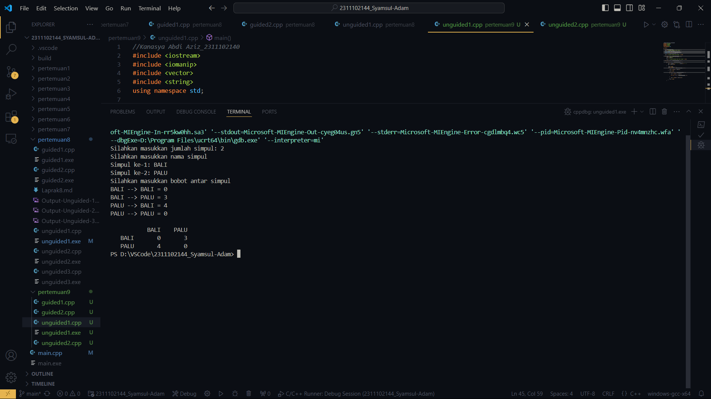
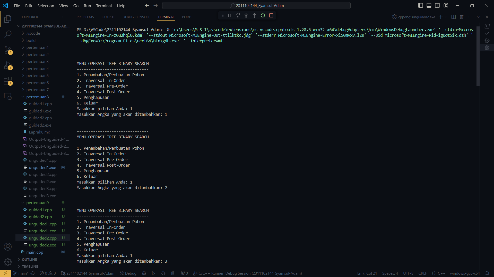
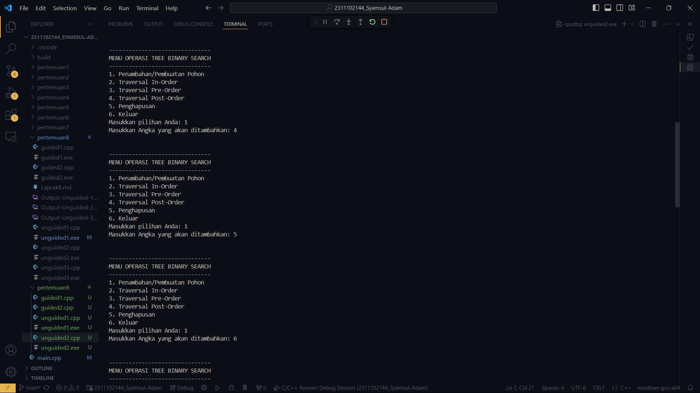
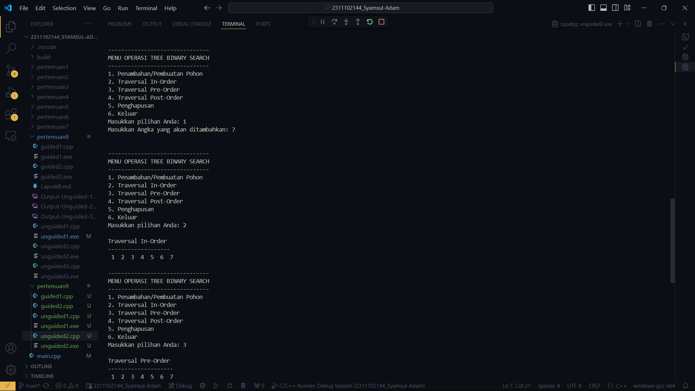
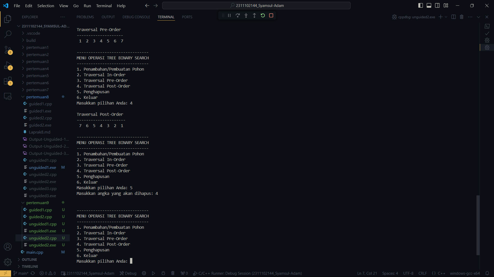

# <h1 align="center">Laporan Praktikum Modul 9 GRAPH & TREE</h1>
<p align="center">Syamsul Adam - 2311102144</p>

## Dasar Teori

Dasar Teori Graf
1. Definisi Graf
Graf adalah struktur matematika yang digunakan untuk memodelkan hubungan antar objek. Graf terdiri dari dua komponen utama:

Vertex (atau Node): Titik-titik yang merepresentasikan objek.
Edge (atau Arc): Garis yang menghubungkan dua vertex, merepresentasikan hubungan antar objek.
Secara formal, graf 
G=(V,E) jika:
E E adalah himpunan tepi yang menghubungkan dua tepi, dan V V adalah himpunan tepi tidak kosong.
2. Jenis-jenis Graf
Graf dapat dikategorikan berdasarkan karakteristiknya:

Graf Tak Berarah (Undirected Graph): Graf di mana setiap edge tidak memiliki arah, sehingga hubungan antara dua vertex bersifat dua arah.
Graf Berarah (Directed Graph atau Digraph): Graf di mana setiap edge memiliki arah, sehingga hubungan antara dua vertex bersifat satu arah.
Graf Berbobot (Weighted Graph): Graf di mana setiap edge memiliki nilai bobot yang menunjukkan kekuatan, jarak, atau biaya hubungan.
Graf Sederhana (Simple Graph): Graf yang tidak memiliki loop (edge yang menghubungkan vertex ke dirinya sendiri) dan tidak memiliki edge ganda antara dua vertex yang sama.
Multigraf (Multigraph): Graf yang dapat memiliki lebih dari satu edge antara sepasang vertex.
Graf Kompleks (Complex Graph): Graf yang bisa memiliki loop dan edge ganda.
3. Terminologi Dasar
Derajat (Degree): Jumlah edge yang terhubung ke sebuah vertex. Derajat dari vertex 
𝑣
v dinyatakan sebagai 
deg(𝑣)
deg(v).
Lintasan (Path): Urutan vertex yang dihubungkan oleh edge, tanpa ada vertex yang terulang.
Siklus (Cycle): Lintasan yang dimulai dan berakhir pada vertex yang sama.
Komponen Terhubung (Connected Component): Subgraf di mana terdapat lintasan antara setiap pasangan vertex.
Graf Terhubung (Connected Graph): Graf di mana terdapat lintasan antara setiap pasangan vertex.
4. Teorema dan Konsep Penting
Teorema Euler: Graf memiliki sirkuit Eulerian (siklus yang melewati setiap edge tepat satu kali) jika dan hanya jika semua vertex memiliki derajat genap.
Teorema Hamiltonian: Graf memiliki sirkuit Hamiltonian (siklus yang melewati setiap vertex tepat satu kali) tidak ada kriteria sederhana yang selalu dapat diaplikasikan, tetapi beberapa kriteria seperti teorema Ore dapat membantu menentukan keberadaan sirkuit Hamiltonian.
Graf Bipartit: Graf yang vertex-nya dapat dibagi menjadi dua himpunan disjoin sedemikian rupa sehingga tidak ada dua vertex dalam himpunan yang sama yang terhubung oleh edge.
5. Representasi Graf
Graf dapat direpresentasikan dengan beberapa cara:

Matriks Adjacency: Matriks yang menunjukkan ada tidaknya edge antara pasangan vertex.
List Adjacency: Daftar di mana setiap vertex menyimpan daftar vertex lain yang terhubung dengannya melalui edge.
Matriks Incidence: Matriks yang menunjukkan hubungan antara vertex dan edge.
6. Algoritma dalam Graf
Beberapa algoritma penting yang sering digunakan dalam graf meliputi:

DFS (Depth-First Search): Algoritma untuk menjelajahi graf dengan menelusuri sepanjang satu cabang sebelum kembali (backtracking).
BFS (Breadth-First Search): Algoritma untuk menjelajahi graf secara level-order.
Algoritma Dijkstra: Algoritma untuk menemukan lintasan terpendek dalam graf berbobot.
Algoritma Kruskal: Algoritma untuk menemukan Minimum Spanning Tree (MST) dalam graf berbobot.
Algoritma Prim: Algoritma lain untuk menemukan MST.

2. TREE
1. Definisi Pohon
Pohon adalah jenis khusus dari graf yang tidak mengandung siklus dan terhubung. Pohon memiliki beberapa karakteristik penting:

Vertex (atau Node): Titik-titik yang merepresentasikan elemen.
Edge (atau Arc): Garis yang menghubungkan dua vertex, mewakili hubungan antar elemen.
Secara formal, pohon T T adalah graf tak berarah T=(V,E) yang memenuhi syarat:
Terhubung: Terdapat lintasan antara setiap pasangan vertex.
Acyclic: Tidak mengandung siklus.
2. Jenis-jenis Pohon
Pohon dapat dikategorikan berdasarkan struktur dan sifatnya:

Pohon Biner (Binary Tree): Pohon di mana setiap node memiliki paling banyak dua anak.
Pohon Biner Pencarian (Binary Search Tree): Pohon biner di mana setiap node memiliki nilai yang lebih besar dari semua nilai di subpohon kirinya dan lebih kecil dari semua nilai di subpohon kanannya.
Pohon AVL: Pohon biner pencarian yang selalu terjaga keseimbangannya dengan memastikan selisih tinggi antara subpohon kiri dan subpohon kanan dari setiap node tidak lebih dari satu.
Heap: Pohon biner lengkap di mana setiap parent node memiliki nilai yang lebih besar (max heap) atau lebih kecil (min heap) dari nilai anak-anaknya.
Pohon Merkle: Pohon biner yang digunakan dalam sistem keamanan dan kriptografi untuk verifikasi data yang efisien dan aman.
3. Terminologi Dasar
Akar (Root): Node paling atas dalam pohon.
Daun (Leaf): Node yang tidak memiliki anak.
Tingkat (Level): Jarak dari root ke node tersebut. Root berada di level 0.
Tinggi (Height): Jarak maksimum dari root ke daun mana pun.
Subpohon (Subtree): Pohon yang terdiri dari node dan semua keturunannya dari suatu node tertentu.
Induk (Parent): Node yang terhubung langsung ke node lain di atasnya.
Anak (Child): Node yang terhubung langsung ke node lain di bawahnya.
4. Teorema dan Konsep Penting
Jumlah Edge: Dalam pohon yang memiliki n n node, selalu ada tepi n - 1 n-1.
Properti Rekursif: Setiap subpohon dari sebuah pohon juga merupakan pohon.
Traversal Pohon: Metode untuk mengunjungi semua node dalam pohon. Terdapat tiga jenis traversal utama:
Preorder: Kunjungi root, traverse subpohon kiri, lalu traverse subpohon kanan.
Inorder: Traverse subpohon kiri, kunjungi root, lalu traverse subpohon kanan.
Postorder: Traverse subpohon kiri, traverse subpohon kanan, lalu kunjungi root.
5. Representasi Pohon
Pohon dapat direpresentasikan dengan beberapa cara:

List Anak: Setiap node menyimpan daftar anak-anaknya.
Parent Pointer: Setiap node menyimpan referensi ke parent-nya.
Matriks Adjacency: Matriks yang menunjukkan ada tidaknya edge antara pasangan node.
List Adjacency: Daftar di mana setiap node menyimpan daftar node lain yang terhubung dengannya melalui edge.
6. Algoritma dalam Pohon
Beberapa algoritma penting yang sering digunakan dalam pohon meliputi:

Insertion dan Deletion dalam Binary Search Tree: Algoritma untuk menambah dan menghapus node sambil menjaga sifat pohon biner pencarian.
Traversal (Preorder, Inorder, Postorder): Algoritma untuk mengunjungi semua node dalam urutan tertentu.
Balancing AVL Tree: Algoritma untuk menjaga keseimbangan pohon AVL setelah operasi insertion atau deletion.
Heapify dan Extract-Max dalam Heap: Algoritma untuk menjaga sifat heap setelah operasi insertion atau deletion.
Lowest Common Ancestor (LCA): Algoritma untuk menemukan node terendah yang menjadi ancestor bersama dari dua node dalam pohon.

## Guided 

### 1. [Guided 1]

```C++
#include <iostream>
#include <iomanip>

using namespace std;
string simpul[7] = {
    "Ciamis", "Bandung", "Bekasi", "Tasikmalaya", "Cianjur", "Purwokerto", "Yogyakarta"
};
int busur[7][7] = {
    {0, 7, 8, 0, 0, 0, 0},
    {0, 0, 5, 0, 0, 15, 0},
    {0, 6, 0, 0, 5, 0, 0},
    {0, 5, 0, 0, 2, 4, 0},
    {23, 0, 0, 10, 0, 0, 8},
    {0, 0, 0, 0, 7, 0, 3},
    {0, 0, 0, 0, 9, 4, 0}
};

void tampilGraph() {
    for (int baris=0; baris<7; baris++) {
        cout << " " << setiosflags(ios::left) << setw(15) << simpul[baris] << " : ";
        for (int kolom=0; kolom<7; kolom++) {
            if (busur[baris][kolom] != 0) {
                cout << " " << simpul[kolom] << "(" << busur[baris][kolom] << ") ";
            }
        } cout << endl;
    }
}

int main() {
    tampilGraph();
    return 0;
}
```

Program C++ ini adalahrepresentasi grafis menggunakan matriks busur (adjacency matrix) di C++. Koneksi antar beberapa kota di Jawa Barat dan Jawa Tengah ditunjukkan dalam grafis yang dibuat oleh program ini.Program menggunakan variabel dan fungsi berikut:

String simpul[7]: kumpulan string yang mengandung nama-nama kota sebagai node atau simpul dalam graph, seperti "Ciamis", "Bandung", "Bekasi", "Tasikmalaya", "Cianjur", "Purwokerto", dan "Yogyakarta".
Matriks busur[7][7]: Matriks jarak 7 kali 7 adalah matriks jarak yang menyimpan jarak antar kota. Matriks ini bernilai 0 jika dua kota tidak terhubung, dan bernilai 1 jika dua kota terhubung.
Graph void: Fungsi ini digunakan untuk menampilkan representasi grafis dalam bentuk matriks busur.

### 2. [Guided 2]

```C++
#include <iostream>
#include <iomanip>

using namespace std;

struct Pohon
{
    char data;
    Pohon *left, *right, *parent;
};

Pohon *root, *baru;

void init()
{
    root = NULL;
}

bool isEmpty()
{
    return root == NULL;
}

void buatNode(char data)
{
    if (isEmpty())
    {
        root = new Pohon();
        root->data = data;
        root->left = NULL;
        root->right = NULL;
        root->parent = NULL;
        cout << "\n Node " << data << " berhasil dibuat sebagai root."
             << endl;
    }
    else
    {
        cout << "\n Tree sudah ada!" << endl;
    }
}

Pohon *insertLeft(char data, Pohon *node)
{
    if (isEmpty())
    {
        cout << "\n Buat tree terlebih dahulu!" << endl;
        return NULL;
    }
    else
    {
        if (node->left != NULL)
        {
            cout << "\n Node " << node->data << " sudah ada child kiri !" << endl;
            return NULL;
        }
        else
        {
            Pohon *baru = new Pohon();
            baru->data = data;
            baru->left = NULL;
            baru->right = NULL;
            baru->parent = node;
            node->left = baru;
            cout << "\n Node " << data << " berhasil ditambahkan ke child kiri " << baru->parent->data << endl;
            return baru;
        }
    }
}

Pohon *insertRight(char data, Pohon *node)
{
    if (isEmpty())
    {
        cout << "\n Buat tree terlebih dahulu!" << endl;
        return NULL;
    }
    else
    {
        if (node->right != NULL)
        {
            cout << "\n Node " << node->data << " sudah ada child kanan !" << endl;
            return NULL;
        }
        else
        {
            Pohon *baru = new Pohon();
            baru->data = data;
            baru->left = NULL;
            baru->right = NULL;
            baru->parent = node;
            node->right = baru;
            cout << "\n Node " << data << " berhasil ditambahkan ke child kanan " << baru->parent->data << endl;
            return baru;
        }
    }
}

void update(char data, Pohon *node)
{
    if (isEmpty())
    {
        cout << "\n Buat tree terlebih dahulu!" << endl;
    }
    else
    {
        if (!node)
        {
            cout << "\n Node yang ingin diganti tidak ada!!" << endl;
        }
        else
        {
            char temp = node->data;
            node->data = data;
            cout << "\n Node " << temp << " berhasil diubah menjadi "
                 << data << endl;
        }
    }
}

void retrieve(Pohon *node)
{
    if (isEmpty())
    {
        cout << "\n Buat tree terlebih dahulu!" << endl;
    }
    else
    {
        if (!node)
        {
            cout << "\n Node yang ditunjuk tidak ada!" << endl;
        }
        else
        {
            cout << "\n Data node : " << node->data << endl;
        }
    }
}

void find(Pohon *node)
{
    if (isEmpty())
    {
        cout << "\n Buat tree terlebih dahulu!" << endl;
    }
    else
    {
        if (!node)
        {
            cout << "\n Node yang ditunjuk tidak ada!" << endl;
        }
        else
        {
            cout << "\n Data Node : " << node->data << endl;
            cout << " Root : " << root->data << endl;
            if (!node->parent)
                cout << " Parent : (tidak punya parent)" << endl;
            else
                cout << " Parent : " << node->parent->data << endl;
            if (node->parent != NULL && node->parent->left != node &&
                node->parent->right == node)
                cout << " Sibling : " << node->parent->left->data << endl;
            else if (node->parent != NULL && node->parent->right != node && node->parent->left == node)
                cout << " Sibling : " << node->parent->right->data << endl;
            else
                cout << " Sibling : (tidak punya sibling)" << endl;
            if (!node->left)
                cout << " Child Kiri : (tidak punya Child kiri)" << endl;
            else
                cout << " Child Kiri : " << node->left->data << endl;
            if (!node->right)
                cout << " Child Kanan : (tidak punya Child kanan)" << endl;
            else
                cout << " Child Kanan : " << node->right->data << endl;
        }
    }
}

// Penelusuran (Traversal)
// preOrder
void preOrder(Pohon *node = root)
{
    if (isEmpty())
    {
        cout << "\n Buat tree terlebih dahulu!" << endl;
    }
    else
    {
        if (node != NULL)
        {
            cout << " " << node->data << ", ";
            preOrder(node->left);
            preOrder(node->right);
        }
    }
}

// inOrder
void inOrder(Pohon *node = root)
{
    if (isEmpty())
    {
        cout << "\n Buat tree terlebih dahulu!" << endl;
    }
    else
    {
        if (node != NULL)
        {
            inOrder(node->left);
            cout << " " << node->data << ", ";
            inOrder(node->right);
        }
    }
}

// postOrder
void postOrder(Pohon *node = root)
{
    if (isEmpty())
    {
        cout << "\n Buat tree terlebih dahulu!" << endl;
    }
    else
    {
        if (node != NULL)
        {
            postOrder(node->left);
            postOrder(node->right);
            cout << " " << node->data << ", ";
        }
    }
}

// Hapus Node Tree
void deleteTree(Pohon *node)
{
    if (isEmpty())
    {
        cout << "\n Buat tree terlebih dahulu!" << endl;
    }
    else
    {
        if (node != NULL)
        {
            if (node != root)
            {
                node->parent->left = NULL;
                node->parent->right = NULL;
            }
            deleteTree(node->left);
            deleteTree(node->right);
            if (node == root)
            {
                delete root;
                root = NULL;
            }
            else
            {
                delete node;
            }
        }
    }
}

// Hapus SubTree
void deleteSub(Pohon *node)
{
    if (isEmpty())
    {
        cout << "\n Buat tree terlebih dahulu!" << endl;
    }
    else
    {
        deleteTree(node->left);
        deleteTree(node->right);
        cout << "\n Node subtree " << node->data << " berhasil dihapus." << endl;
    }
}

void clear()
{
    if (isEmpty())
    {
        cout << "\n Buat tree terlebih dahulu!!" << endl;
    }
    else
    {
        deleteTree(root);
        cout << "\n Pohon berhasil dihapus." << endl;
    }
}

// Cek Size Tree
int size(Pohon *node = root)
{
    if (isEmpty())
    {
        cout << "\n Buat tree terlebih dahulu!!" << endl;
        return 0;
    }
    else
    {
        if (!node)
        {
            return 0;
        }
        else
        {
            return 1 + size(node->left) + size(node->right);
        }
    }
}

// Cek Height Level Tree
int height(Pohon *node = root)
{
    if (isEmpty())
    {
        cout << "\n Buat tree terlebih dahulu!" << endl;
        return 0;
    }
    else
    {
        if (!node)
        {
            return 0;
        }
        else
        {
            int heightKiri = height(node->left);
            int heightKanan = height(node->right);
            if (heightKiri >= heightKanan)
            {
                return heightKiri + 1;
            }
            else
            {
                return heightKanan + 1;
            }
        }
    }
}

// Karakteristik Tree
void characteristic()
{
    cout << "\n Size Tree : " << size() << endl;
    cout << " Height Tree : " << height() << endl;
    cout << " Average Node of Tree : " << size() / height() << endl;
}

int main()
{
    buatNode('A');
    Pohon *nodeB, *nodeC, *nodeD, *nodeE, *nodeF, *nodeG, *nodeH, *nodeI, *nodeJ;
    nodeB = insertLeft('B', root);
    nodeC = insertRight('C', root);
    nodeD = insertLeft('D', nodeB);
    nodeE = insertRight('E', nodeB);
    nodeF = insertLeft('F', nodeC);
    nodeG = insertLeft('G', nodeE);
    nodeH = insertRight('H', nodeE);
    nodeI = insertLeft('I', nodeG);
    nodeJ = insertRight('J', nodeG);
    update('Z', nodeC);
    update('C', nodeC);
    retrieve(nodeC);
    find(nodeC);
    characteristic();

    cout << "\n PreOrder :" << endl;
    preOrder(root);
    cout << "\n"<< endl;

    cout << " InOrder :" << endl;
    inOrder(root);
    cout << "\n" << endl;

    cout << " PostOrder :" << endl;
    postOrder(root);
    cout << "\n" << endl;
}
```
Program C++ ini adalah implementasi algoritma membuat pohon, menambahkan node, mengubah node, menghapus node, dan melakukan traversal (penelusuran) pada pohon dengan program ini, yang bekerja dengan struktur data pohon (tree) di C++.

Program ini dapat melakukan fungsi-fungsi berikut:

init(): Fungsi ini memulai pohon dan mengatur root menjadi NULL. isEmpty(): Fungsi ini menentukan apakah pohon kosong. buatNode(char data): Fungsi ini membuat node baru dengan data yang diberikan dan menambahkannya sebagai root jika pohon masih kosong. insertLeft(char data, Pohon *node): Fungsi ini menambah node baru sebagai anak kiri dari node yang diberikan. insertRight(char data, Pohon *node): Fungsi ini menambah node baru sebagai anak kiri dari node yang diberikan. Update(char data, Pohon *node): Fungsi ini mengubah data node yang diberikan. retrieve(Pohon *node): Fungsi ini menampilkan data node yang diberikan. find(Pohon *node): Fungsi ini menampilkan informasi tentang node yang diberikan, termasuk data, parent, saudara, anak kiri, dan anak kanan.

PreOrder(Pohon *node), InOrder(Pohon *node), dan PostOrder(Pohon *node): Fungsi-fungsi ini digunakan untuk melakukan traversal pada pohon dengan menggunakan metode pre-order, in-order, dan post-order.
deleteTree(Pohon *node): Fungsi ini menghapus pohon secara rekursif; deleteSub(Pohon *node): Fungsi ini menghapus subpohon yang dimulai dari node yang diberikan; clear(): Fungsi ini menghapus pohon secara keseluruhan. size(Pohon *node): Fungsi ini menghitung jumlah node dalam pohon.
height(Pohon *node): Fungsi ini digunakan untuk menghitung tinggi pohon. characteristic(): Fungsi ini menampilkan karakteristik pohon, seperti ukuran, tinggi, dan node rata-rata pohon.
Program ini juga memiliki fungsi untuk melakukan traversal pada pohon dan menampilkan karakteristiknya. Pengguna dapat membuat pohon dengan menggunakan fungsi buatNode() dan menambahkan node baru dengan menggunakan fungsi insertLeft() dan insertRight(). Mereka juga dapat mengupdate node dengan menggunakan fungsi update() dan menghapus node dengan menggunakan fungsi deleteTree() atau deleteSub().
## Unguided 

### 1. [Buatlah program graph dengan menggunakan inputan user untuk menghitung jarak dari sebuah kota ke kota lainnya.!]

```C++
#include <iostream> 
#include <iomanip> 
#include <vector> 
#include <string> 
using namespace std; 

int main() 
{ 
    int syamsul_2311102144; 
    cout << "Silahkan masukkan jumlah simpul: "; 
    cin >> syamsul_2311102144; 
    vector<string> simpul(syamsul_2311102144); 
    vector<vector<int>> busur(syamsul_2311102144, 
    vector<int>(syamsul_2311102144, 0)); 
    
    cout << "Silahkan masukkan nama simpul " << endl; 
    
    for (int i = 0; i < syamsul_2311102144; i++) { 
        cout << "Simpul ke-" << (i + 1) << ": "; 
        cin >> simpul[i]; 
        } 
        cout << "Silahkan masukkan bobot antar simpul" << endl; 
    
    for (int i = 0; i < syamsul_2311102144; i++) { 
        
        for (int j = 0; j < syamsul_2311102144; j++) 
        { 
            cout << simpul[i] << " --> " << simpul[j] << " = "; 
            cin >> busur[i][j];
             }
        } 
             cout << endl; 
             cout << setw(7) << " "; 
             for (int i = 0; i < syamsul_2311102144; i++) {

                cout << setw(8) << simpul[i]; 
            } 
                cout << endl; 
                
                for (int i = 0; i < syamsul_2311102144; i++) 
                { 
                    cout << setw(7) << simpul[i]; 
                    
                    for (int j = 0; j < syamsul_2311102144; j++) 
                    
                {
                    cout << setw(8) << busur[i][j];
                } 
                cout << endl; 
            } 
        }
```

#### Output:


Program ini adalah contoh implementasi representasi graph menggunakan matriks di C++. Program ini memungkinkan pengguna untuk memasukkan jumlah simpul (node) dan nama simpul, serta bobot antar simpul. Pengguna diminta untuk memasukkan jumlah simpul yang ingin dibuat. Program membuat vektor simpul untuk menyimpan nama simpul dan vektor busur untuk menyimpan bobot antar simpul. Pengguna diminta untuk memasukkan nama simpul satu per satu. Pengguna diminta untuk memasukkan bobot antar simpul, yaitu nilai yang menghubungkan dua simpul. Program menampilkan matriks busur yang merepresentasikan graph, dengan nama simpul sebagai header kolom dan baris.
Program ini menggunakan library vector untuk membuat vektor dinamis yang dapat menyimpan data simpul dan bobot antar simpul. Program juga menggunakan library iostream untuk input dan output data. Dengan menggunakan program ini, pengguna dapat membuat graph dengan jumlah simpul yang variabel dan memasukkan bobot antar simpul secara manual. Hasilnya adalah matriks busur yang merepresentasikan graph tersebut.
### 2. [Modifikasi guided tree diatas dengan program menu menggunakan input data tree dari user dan berikan fungsi tambahan untuk menampilkan node child dan descendant dari node yang diinput kan!!]

```C++
#include <iostream> 
using namespace std; 

class BinarySearchTree 
{ 
private: 
    struct nodeTree 
    { 
        nodeTree *left; 
        nodeTree *right; 
        int data; 
    }; 
        nodeTree *root; 
public: 
    BinarySearchTree() 
    { 
        root = NULL; 
    } 
    
    bool isEmpty() const { return root == NULL; } 
    void print_inorder(); 
    void inorder(nodeTree *); 
    void print_preorder(); 
    void preorder(nodeTree *); 
    void print_postorder(); 
    void postorder(nodeTree *); 
    void insert(int); 
    void remove(int); 
}; 
void BinarySearchTree::insert(int a) 
{ 
    nodeTree *t = new nodeTree; 
    nodeTree *parent; 
    t->data = a; 
    t->left = NULL; 
    t->right = NULL; 
    parent = NULL; 
    
    if (isEmpty()) 
        root = t; 
    else 
    { 
        nodeTree *current; 
        current = root;
        while (current) 
        { 
            parent = current; 
            if (t->data > current->data) 
                current = current->right; 
            else 
                current = current->left; 
        } 
        
        if (t->data < parent->data) 
            parent->left = t; 
        else 
            parent->right = t; 
    } 
} 
void BinarySearchTree::remove(int a) 
{ 
    // Mencari elemen yang akan dihapus 
    bool found = false; 
    if (isEmpty()) 
    { 
        cout << "Pohon ini kosong!" << endl; 
        return; 
    } 
    
    nodeTree *current; 
    nodeTree *parent; 
    current = root; 
    
    while (current != NULL) 
    { 
        if (current->data == a) 
        { 
            found = true; 
            break; 
    } else { 
        parent = current; 
        if (a > current->data) 
            current = current->right; 
        else
            current = current->left;

        } 
    } 
    if (!found) 
    { 
        cout << "Data tidak ditemukan!" << endl; 
        return; 
    } 
    
    // Node dengan satu anak 
    if ((current->left == NULL && current->right != NULL) || (current->left != NULL && current->right == NULL)) { 
        
        if (current->left == NULL && current->right != NULL) { 
            
            if (parent->left == current) 
            { 
                parent->left = current->right; 
                delete current; 
            } 
            else 
            { 
                parent->right = current->right; 
                delete current; 
            } 
        } 
        else 
        { 
            if (parent->left == current) 
            { 
                parent->left = current->left; 
                delete current; 
            } 
            else 
            { 
                parent->right = current->left; 
                delete current; 
            } 
        } 
        return;
    } 
    
    // Node tanpa anak
    if (current->left == NULL && current->right == NULL) 
    { 
        if (parent->left == current) 
            parent->left = NULL; 
        else 
            parent->right = NULL; 
        delete current; 
        return; 
    } 
    
    // Node dengan dua anak 
    // Ganti node dengan nilai terkecil pada subtree sebelah kanan 
    if (current->left != NULL && current->right != NULL) 
    { 
        nodeTree *temp; 
        temp = current->right; 
        if ((temp->left == NULL) && (temp->right == NULL)) 
        { 
            current = temp; 
            delete temp; 
            current->right = NULL; 
        } 
        else 
        { 
            if ((current->right)->left != NULL) 
            { 
                nodeTree *lcurrent; 
                nodeTree *lcurrp; 
                lcurrp = current->right; 
                lcurrent = (current->right)->left; 
                while (lcurrent->left != NULL) 
                { 
                    lcurrp = lcurrent; 
                    lcurrent = lcurrent->left; 
                } 
                current->data = lcurrent->data; 
                delete lcurrent; 
                lcurrp->left = NULL; 
                
            } 
            else
            { 
                nodeTree *tmp2; 
                tmp2 = current->right; 
                current->data = tmp2->data; 
                current->right = tmp2->right; 
                delete tmp2; 
            } 
        } 
        return; 
    } 
} 
void BinarySearchTree::print_inorder() 
{ 
    inorder(root); 
} 
void BinarySearchTree::inorder(nodeTree *b) 
{ 
    if (b != NULL) 
    { 
        if (b->left) 
            inorder(b->left); 
        cout << " " << b->data << " "; 
        if (b->right) 
            inorder(b->right); 
    } 
    else 
        return; 
} 
void BinarySearchTree::print_preorder() 
{ 
    preorder(root); 
} 
void BinarySearchTree::preorder(nodeTree *b) 
{ 
    if (b != NULL) 
    { 
        cout << " " << b->data << " "; 
        if (b->left) 
            preorder(b->left); 
        if (b->right) 
            preorder(b->right);

    } 
    else 
        return; 
} 
void BinarySearchTree::print_postorder() 
{ 
    postorder(root); 
} 
void BinarySearchTree::postorder(nodeTree *b) 
{ 
    if (b != NULL) 
    { 
        if (b->left) 
            postorder(b->left); 
        if (b->right) 
            postorder(b->right); 
        cout << " " << b->data << " "; 
    } 
    else 
        return; 
} 

int main() 
{ 
    BinarySearchTree b; 
    int ch, tmp, tmp1; 
    while (1) 
    { 
        cout << endl << endl; cout << "-------------------------------" << endl; 
        cout << "MENU OPERASI TREE BINARY SEARCH" << endl; 
        cout << "-------------------------------" << endl; 
        cout << "1. Penambahan/Pembuatan Pohon" << endl; 
        cout << "2. Traversal In-Order" << endl; 
        cout << "3. Traversal Pre-Order" << endl; 
        cout << "4. Traversal Post-Order" << endl; 
        cout << "5. Penghapusan" << endl; 
        cout << "6. Keluar" << endl;
        cout << "Masukkan pilihan Anda: "; 
        cin >> ch; 
        switch (ch) 
        { 
            case 1: cout << "Masukkan Angka yang akan ditambahkan: "; 
            cin >> tmp; 
            b.insert(tmp); 
            break; 
            
            case 2: 
            cout << endl; 
            cout << "Traversal In-Order" << endl; 
            cout << "-------------------" << endl; 
            b.print_inorder(); 
            break; 
            
            case 3: 
            cout << endl; 
            cout << "Traversal Pre-Order" << endl; 
            cout << "--------------------" << endl; 
            b.print_preorder(); 
            break; 
            
            case 4: 
            cout << endl; 
            cout << "Traversal Post-Order" << endl; 
            cout << "---------------------" << endl; 
            b.print_postorder(); 
            break; 
            
            case 5: 
            cout << "Masukkan angka yang akan dihapus: "; 
            cin >> tmp1; 
            b.remove(tmp1); 
            break; 
            
            case 6: 
            return 0; 
        } 
    } 
}
```

#### Output:





Program ini adalah implementasi Binary Search Tree (BST) di C++. Program ini memungkinkan pengguna untuk membuat pohon, menambahkan node, menghapus node, dan melakukan traversal (penelusuran) pada pohon.Program ini menggunakan struktur data nodeTree untuk merepresentasikan node dalam pohon. Setiap node memiliki tiga komponen, yaitu left untuk anak kiri, right untuk anak kanan, dan data untuk nilai node. Fungsi insert digunakan untuk menambahkan node baru ke pohon. Fungsi ini akan mencari tempat yang tepat untuk menambahkan node baru berdasarkan nilai node yang sudah ada. Fungsi remove digunakan untuk menghapus node dari pohon. Fungsi ini akan mencari node yang ingin dihapus dan menghapusnya dari pohon. Fungsi print_inorder, print_preorder, dan print_postorder digunakan untuk melakukan traversal pada pohon dan menampilkan hasilnya. Program ini juga memiliki menu yang memungkinkan pengguna untuk memilih operasi yang ingin dilakukan, seperti menambahkan node, menghapus node, atau melakukan traversal.

## Kesimpulan
Graph : Program ini memungkinkan pengguna untuk membuat graph dengan jumlah simpul yang variabel dan memasukkan bobot antar simpul secara manual. Hasilnya adalah matriks busur yang merepresentasikan graph tersebut. Program ini menggunakan library vector untuk membuat vektor dinamis yang dapat menyimpan data simpul dan bobot antar simpul, serta library iostream untuk input dan output data.
Binary Search Tree (BST): Program ini memungkinkan pengguna untuk membuat pohon, menambahkan node, menghapus node, dan melakukan traversal (penelusuran) pada pohon. Program ini menggunakan struktur data nodeTree untuk merepresentasikan node dalam pohon. Setiap node memiliki tiga komponen, yaitu left untuk anak kiri, right untuk anak kanan, dan data untuk nilai node. Fungsi insert digunakan untuk menambahkan node baru ke pohon, fungsi remove digunakan untuk menghapus node dari pohon, dan fungsi print_inorder, print_preorder, dan print_postorder digunakan untuk melakukan traversal pada pohon dan menampilkan hasilnya. Program ini juga memiliki menu yang memungkinkan pengguna untuk memilih operasi yang ingin dilakukan, seperti menambahkan node, menghapus node, atau melakukan traversal.

## Referensi
[1] [Y. Rahmanto, M. F. Randhika, F. Ulum, and B. Priyopradono, “Aplikasi pembelajaran audit sistem informasi dan tata kelola teknologi informasi berbasis Mobile,” J. TEKNOKOMPAK, vol. 14, no. 2, pp. 62–67, Aug. 2020, doi:10.33365/jtk.v14i2.723](http://file.upi.edu/Direktori/FPMIPA/JUR._PEND._MATEMATIKA/196303311988031-NANANG_PRIATNA/Pengetahuan_Dasar_Teori_Graph.pdf)
[2] [Y Rahmanto, J Alfian, D Damayanti - Jurnal Buana Informatika, 2021](https://www.coursehero.com/file/17720126/Graph-and-tree/)